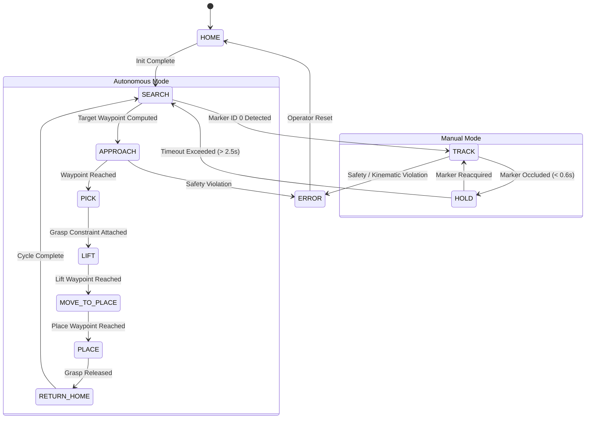

# Systems Architecture & Technical Specification

## VisionRobotTwin: Real-Time Vision-Guided Robotic Manipulator Digital Twin

---

## 1. System Overview

VisionRobotTwin is designed as a modular, high-throughput perception-to-action robotics control pipeline. The software architecture strictly decouples:
- **Perception Subsystem**: Frame capture, fiducial detection, camera calibration, and 6-DoF pose estimation.
- **Kinematics & Transformation Subsystem**: Coordinate transformations ($SE(3)$), workspace bounding, and inverse kinematics.
- **Control & Simulation Subsystem**: Digital twin physics stepping, joint position control, virtual grasp constraints, and telemetry.
- **State Machine Subsystem**: Deterministic behavior control, timeout handling, and autonomous sequencing.

```mermaid
graph TB
    subgraph Vision ["Perception Subsystem"]
        Cam[Camera / Synthetic Gen] --> Gray[Grayscale & Preprocessing]
        Gray --> Det[cv2.aruco.ArucoDetector]
        Det --> PnP[PnP Pose Estimation]
        PnP --> Calib[Camera Calibration Intrinsics]
        PnP --> PoseFilt[PoseFilter: EMA / 1-Euro & SLERP]
    end

    subgraph Kinematics ["Kinematics Subsystem"]
        PoseFilt --> SE3["SE(3) Coordinate Transform: T_B_M = T_B_C @ T_C_M"]
        SE3 --> WSMapper[Workspace Mapper & Bounds Clamping]
        WSMapper --> SlewRate[Slew-Rate Velocity Limiter]
        SlewRate --> IKSolver[Damped Least-Squares IK]
    end

    subgraph Simulation ["Digital Twin Simulation"]
        IKSolver --> MotorCtrl[Joint Motor Position Control]
        MotorCtrl --> Panda[Franka Panda Manipulator (7-DoF)]
        Panda --> Gripper[Virtual Gripper Constraint Manager]
        Panda --> PhysStep[PyBullet Physics Engine (240 Hz)]
    end

    subgraph Telemetry ["Telemetry & UI"]
        Panda --> FwdKin[Forward Kinematics & Tracking Error]
        FwdKin --> HUD[OpenCV Heads-Up Display]
        PhysStep --> TrajViz[3D Trajectory Debug Lines]
    end
```

---

## 2. Mathematical Formulations

### 2.1 PnP Pose Estimation & Camera Model
Given a set of 3D object points $\mathbf{P}_i = [X_i, Y_i, Z_i]^T$ in the marker frame $\mathcal{F}_M$ and corresponding 2D image coordinates $\mathbf{p}_i = [u_i, v_i]^T$, the perspective projection under the pinhole camera model is:

$$s \begin{bmatrix} u_i \\ v_i \\ 1 \end{bmatrix} = \mathbf{K} \left( \mathbf{R}_{C \to M} \mathbf{P}_i + \mathbf{t}_{C \to M} \right)$$

Where the intrinsic camera matrix $\mathbf{K}$ is defined as:

$$\mathbf{K} = \begin{bmatrix} f_x & 0 & c_x \\ 0 & f_y & c_y \\ 0 & 0 & 1 \end{bmatrix}$$

And lens distortion is corrected using the Brown-Conrady polynomial model:

$$x_{\text{dist}} = x(1 + k_1 r^2 + k_2 r^4 + k_3 r^6) + 2 p_1 x y + p_2 (r^2 + 2x^2)$$
$$y_{\text{dist}} = y(1 + k_1 r^2 + k_2 r^4 + k_3 r^6) + p_1 (r^2 + 2y^2) + 2 p_2 x y$$

The Infinitesimal Plane-based Pose Estimation (IPPE) solver resolves $\mathbf{R}_{C \to M} \in SO(3)$ and $\mathbf{t}_{C \to M} \in \mathbb{R}^3$.

### 2.2 SE(3) Transformation Composition
Rigid transformations are represented as $4 \times 4$ matrices in the Special Euclidean Group $SE(3)$:

$$\mathbf{T} = \begin{bmatrix} \mathbf{R} & \mathbf{t} \\ \mathbf{0}_{1\times3} & 1 \end{bmatrix}$$

Given the static camera mounting transform $\mathbf{T}_{B \to C}$ in robot base coordinates $\mathcal{F}_B$ and the detected marker transform $\mathbf{T}_{C \to M}$ in camera optical coordinates $\mathcal{F}_C$, the global marker pose $\mathbf{T}_{B \to M}$ is computed as:

$$\mathbf{T}_{B \to M} = \mathbf{T}_{B \to C} \cdot \mathbf{T}_{C \to M}$$

Matrix inversion is performed analytically:

$$\mathbf{T}^{-1} = \begin{bmatrix} \mathbf{R}^T & -\mathbf{R}^T \mathbf{t} \\ \mathbf{0}_{1\times3} & 1 \end{bmatrix}$$

### 2.3 1 Euro Adaptive Filtering
To eliminate optical tracking jitter at low velocities without introducing phase lag during rapid motion, the 1 Euro filter adjusts its low-pass cutoff frequency $\hat{f}_c$ dynamically:

$$\hat{f}_c = f_{c,\min} + \beta \|\dot{\mathbf{x}}\|, \quad \alpha = \frac{1}{1 + \frac{1}{2\pi \hat{f}_c \Delta t}}$$
$$\hat{\mathbf{x}}_k = \alpha \mathbf{x}_k + (1 - \alpha) \hat{\mathbf{x}}_{k-1}$$

---

## 3. Kinematics & Joint Control

### 3.1 Inverse Kinematics (PyBullet Damped Least-Squares)
The Franka Emika Panda arm has 7 revolute joints ($\mathbf{q} \in \mathbb{R}^7$). The relationship between end-effector Cartesian velocity $\dot{\mathbf{x}} \in \mathbb{R}^6$ and joint velocities $\dot{\mathbf{q}}$ is governed by the manipulator Jacobian $\mathbf{J}(\mathbf{q}) \in \mathbb{R}^{6 \times 7}$:

$$\dot{\mathbf{x}} = \mathbf{J}(\mathbf{q}) \dot{\mathbf{q}}$$

To handle kinematic singularities and joint limits gracefully, Damped Least-Squares (DLS) is employed:

$$\Delta \mathbf{q} = \mathbf{J}^T (\mathbf{J} \mathbf{J}^T + \lambda^2 \mathbf{I})^{-1} \mathbf{e}_{\text{task}} + (\mathbf{I} - \mathbf{J}^\dagger \mathbf{J}) \nabla H(\mathbf{q})$$

Where:
- $\lambda$ is the damping constant ($\approx 0.01$).
- $\mathbf{e}_{\text{task}} = \mathbf{x}_{\text{desired}} - \mathbf{x}_{\text{current}}$ is Cartesian error.
- $(\mathbf{I} - \mathbf{J}^\dagger \mathbf{J}) \nabla H(\mathbf{q})$ projects nullspace optimization toward the nominal rest posture $\mathbf{q}_{\text{home}}$ to keep the arm away from joint limits.

### 3.2 Joint Position Control Loop
Joint position control is commanded via PyBullet's multi-motor controller:

$$\tau_i = k_p (q_{i,\text{target}} - q_{i,\text{actual}}) - k_d \dot{q}_{i,\text{actual}}$$

With torque limits $\tau_{\max} = 200\text{ N}\cdot\text{m}$ and velocity limits $\dot{q}_{\max} = 2.0\text{ rad/s}$.

---

## 4. Finite State Machine (FSM) Specification

The system transitions across 11 deterministic states:



---

## 5. Software Safety & Failure Recovery

1. **Workspace Boundary Enforcer**: All Cartesian coordinates are clipped to the bounding box $[0.25 \le X \le 0.70\text{ m}, -0.40 \le Y \le 0.40\text{ m}, 0.08 \le Z \le 0.65\text{ m}]$.
2. **Slew-Rate Displacement Limiter**: Target changes exceeding $\Delta d_{\max} = 2.5\text{ cm}$ per control frame are truncated along the direction vector, preventing joint shock.
3. **NaN & Infinity Rejection**: Any non-finite values from perception or matrix inversion immediately trigger a fallback to the last valid safe posture.
4. **Graceful Degradation**: If camera calibration is missing, the system warns the user and initializes a synthetic pinhole model rather than crashing.
5. **Clean Resource Cleanup**: Signal handlers and context destructors ensure `cv2.destroyAllWindows()`, `camera.release()`, and `p.disconnect()` execute under all exit conditions.

---

## 6. Verification & QA Matrix

| Subsystem | Test Module | Verification Method | Pass Criteria |
| :--- | :--- | :--- | :--- |
| Transforms | `test_transforms.py` | Analytical math checks | $R R^T = I$, $\det(R) = 1$, $T T^{-1} = I$ |
| Filters | `test_filters.py` | Step response & noise variance | Variance reduction $> 60\%$, step error $< 5\%$ |
| Workspace | `test_workspace.py` | Out-of-bounds boundary injection | Target strictly in $[X, Y, Z]$ bounds |
| FSM | `test_state_machine.py` | Event simulation & timeouts | Correct progression across all states |
| Vision | `test_pose_utils.py` | Synthetic marker PnP check | Detected ID 0, $Z > 0$, metric error $< 1\text{ mm}$ |
| Digital Twin | `test_ik_and_robot.py` | Headless PyBullet simulation | IK converges, error $< 4.5\text{ cm}$ dynamically |
