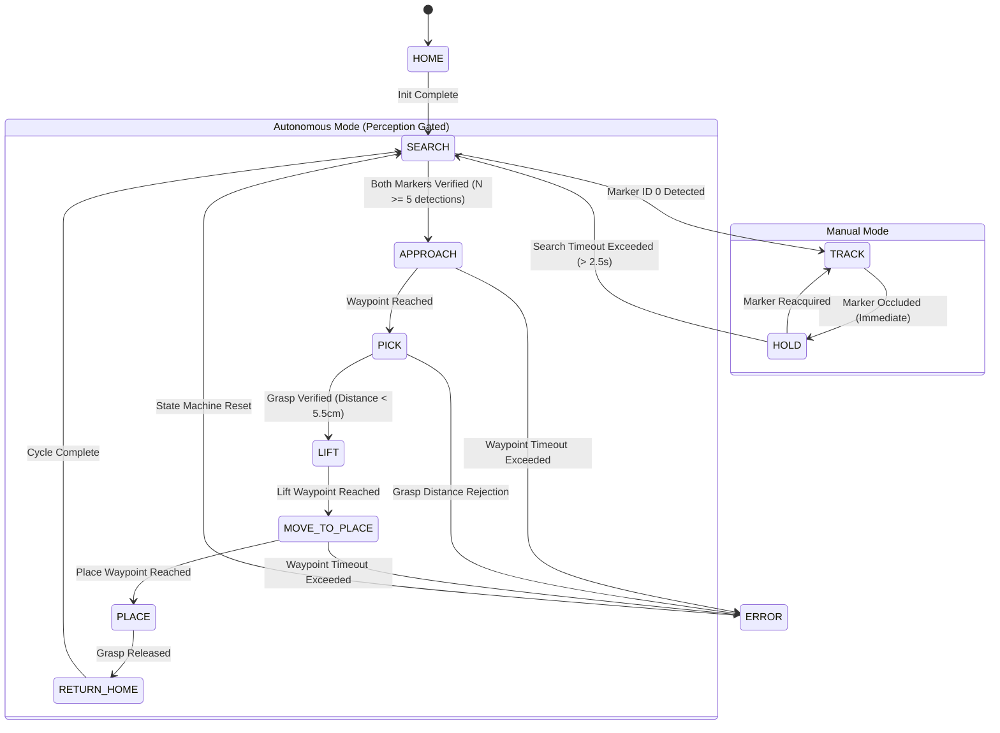

# Systems Architecture & Technical Specification

## VisionRobotTwin (v1.1 Engineering Hardening)

---

## 1. System Overview

VisionRobotTwin is designed as a modular, high-throughput perception-to-action robotics control pipeline. The software architecture strictly decouples:
- **Perception Subsystem**: Frame capture, fiducial detection, camera calibration, and 6-DoF pose estimation.
- **Kinematics & Transformation Subsystem**: Coordinate transformations ($SE(3)$), workspace bounding, time-based slew limiting, and inverse kinematics.
- **Control & Simulation Subsystem**: Digital twin physics stepping, joint position control, distance-gated virtual grasp constraints, and telemetry.
- **State Machine Subsystem**: Perception-gated behavior control, timeout handling, and autonomous sequencing.

```mermaid
graph TB
    subgraph Vision ["Perception Subsystem"]
        Cam[Camera / Synthetic Gen] --> Gray[Grayscale & Preprocessing]
        Gray --> Det[cv2.aruco.ArucoDetector]
        Det --> PnP[PnP Pose Estimation]
        PnP --> Calib[Camera Calibration Intrinsics]
        PnP --> PoseFilt[PoseFilter: EMA / 1-Euro & SLERP]
    end

    subgraph Kinematics ["Kinematics Subsystem"]
        PoseFilt --> SE3["SE(3) Coordinate Transform: T_B_M = T_B_C @ T_C_M"]
        SE3 --> WSMapper[Workspace Mapper & Bounds Clamping]
        WSMapper --> SlewRate[Time-Based Slew Rate Limiter]
        SlewRate --> IKSolver[Damped Least-Squares IK]
    end

    subgraph Simulation ["Digital Twin Simulation"]
        IKSolver --> MotorCtrl[Joint Motor Position Control]
        MotorCtrl --> Panda[Franka Panda Manipulator (7-DoF)]
        Panda --> Gripper[Distance-Gated Virtual Gripper Manager]
        Panda --> PhysStep[PyBullet Physics Engine (240 Hz)]
    end

    subgraph Telemetry ["Telemetry & UI"]
        Panda --> FwdKin[Forward Kinematics & Tracking Error]
        FwdKin --> HUD[OpenCV Heads-Up Display]
        PhysStep --> TrajViz[3D Trajectory Debug Lines]
    end
```

---

## 2. Mathematical Formulations

### 2.1 PnP Pose Estimation & Camera Model
Given a set of 3D object points $\mathbf{P}_i = [X_i, Y_i, Z_i]^T$ in marker frame $\mathcal{F}_M$ and corresponding 2D image coordinates $\mathbf{p}_i = [u_i, v_i]^T$, the perspective projection under the pinhole camera model is:

$$s \begin{bmatrix} u_i \\ v_i \\ 1 \end{bmatrix} = \mathbf{K} \left( \mathbf{R}_{C \to M} \mathbf{P}_i + \mathbf{t}_{C \to M} \right)$$

Where the intrinsic camera matrix $\mathbf{K}$ is defined as:

$$\mathbf{K} = \begin{bmatrix} f_x & 0 & c_x \\ 0 & f_y & c_y \\ 0 & 0 & 1 \end{bmatrix}$$

The Infinitesimal Plane-based Pose Estimation (IPPE) solver resolves $\mathbf{R}_{C \to M} \in SO(3)$ and $\mathbf{t}_{C \to M} \in \mathbb{R}^3$.

### 2.2 SE(3) Transformation Pipeline
Rigid transformations are represented as $4 \times 4$ matrices in $SE(3)$:

$$\mathbf{T} = \begin{bmatrix} \mathbf{R} & \mathbf{t} \\ \mathbf{0}_{1\times3} & 1 \end{bmatrix}$$

Given the camera mounting transform $\mathbf{T}_{B \to C}$ in robot base coordinates $\mathcal{F}_B$ and the detected marker transform $\mathbf{T}_{C \to M}$ in camera optical coordinates $\mathcal{F}_C$, the global marker pose $\mathbf{T}_{B \to M}$ is computed as:

$$\mathbf{T}_{B \to M} = \mathbf{T}_{B \to C} \cdot \mathbf{T}_{C \to M}$$

Matrix inversion is performed analytically:

$$\mathbf{T}^{-1} = \begin{bmatrix} \mathbf{R}^T & -\mathbf{R}^T \mathbf{t} \\ \mathbf{0}_{1\times3} & 1 \end{bmatrix}$$

### 2.3 World-Anchor Camera-to-Virtual-Robot Extrinsic Calibration
To ground the camera optical coordinate frame $\mathcal{F}_C$ in the Franka Panda base coordinate frame $\mathcal{F}_R$, a dedicated ArUco World Anchor Marker (**Marker ID 10**) is placed at a known, configured rigid pose $\mathbf{T}_{\text{robot}\to\text{anchor}} \in SE(3)$.

Upon detecting the anchor marker in the optical frame $\mathbf{T}_{\text{camera}\to\text{anchor}}$, the rigid transform $\mathbf{T}_{\text{robot}\to\text{camera}}$ is solved analytically:

$$\mathbf{T}_{\text{robot}\to\text{camera}} = \mathbf{T}_{\text{robot}\to\text{anchor}} \cdot \mathbf{T}_{\text{camera}\to\text{anchor}}^{-1}$$

Where:
- $\mathbf{T}_{\text{camera}\to\text{anchor}}^{-1} = \begin{bmatrix} \mathbf{R}^T & -\mathbf{R}^T \mathbf{t} \\ \mathbf{0} & 1 \end{bmatrix}$ is the exact Lie group analytical inverse.
- Multi-sample robust median pose aggregation with $> 3\sigma$ Euclidean and geodesic outlier filtering removes optical noise.
- Repeatability is quantified via translation standard deviation $\sigma_{\text{pos}}$ (mm) and geodesic rotation dispersion $\sigma_{\text{rot}}$ (deg).

### 2.4 1 Euro Adaptive Filtering
To eliminate optical tracking jitter at low velocities without introducing phase lag during rapid motion, the 1 Euro filter adjusts its low-pass cutoff frequency $\hat{f}_c$ dynamically:

$$\hat{f}_c = f_{c,\min} + \beta \|\dot{\mathbf{x}}\|, \quad \alpha = \frac{1}{1 + \frac{1}{2\pi \hat{f}_c \Delta t}}$$
$$\hat{\mathbf{x}}_k = \alpha \mathbf{x}_k + (1 - \alpha) \hat{\mathbf{x}}_{k-1}$$

---

## 3. Kinematics & Joint Control

### 3.1 Inverse Kinematics (PyBullet Damped Least-Squares)
The Franka Emika Panda arm has 7 revolute joints ($\mathbf{q} \in \mathbb{R}^7$). The relationship between end-effector Cartesian velocity $\dot{\mathbf{x}} \in \mathbb{R}^6$ and joint velocities $\dot{\mathbf{q}}$ is governed by the manipulator Jacobian $\mathbf{J}(\mathbf{q}) \in \mathbb{R}^{6 \times 7}$:

$$\dot{\mathbf{x}} = \mathbf{J}(\mathbf{q}) \dot{\mathbf{q}}$$

To handle kinematic singularities and joint limits gracefully, Damped Least-Squares (DLS) is employed:

$$\Delta \mathbf{q} = \mathbf{J}^T (\mathbf{J} \mathbf{J}^T + \lambda^2 \mathbf{I})^{-1} \mathbf{e}_{\text{task}} + (\mathbf{I} - \mathbf{J}^\dagger \mathbf{J}) \nabla H(\mathbf{q})$$

Where:
- $\lambda$ is the damping constant ($\approx 0.01$).
- $\mathbf{e}_{\text{task}} = \mathbf{x}_{\text{desired}} - \mathbf{x}_{\text{current}}$ is Cartesian position and orientation error.
- $(\mathbf{I} - \mathbf{J}^\dagger \mathbf{J}) \nabla H(\mathbf{q})$ projects nullspace optimization toward nominal rest posture $\mathbf{q}_{\text{home}}$ to keep the arm away from joint limits.

### 3.2 Time-Based Cartesian and Angular Slew Limiter
Displacement increments are bounded per elapsed time $\Delta t$:

$$\Delta \mathbf{p} = \text{clip}\left(\mathbf{p}_{\text{target}} - \mathbf{p}_{\text{prev}}, \|\Delta \mathbf{p}\| \le v_{\max} \Delta t\right)$$
$$\Delta \theta = \text{SLERP}\left(\mathbf{q}_{\text{prev}}, \mathbf{q}_{\text{target}}, \min\left(1.0, \frac{\omega_{\max} \Delta t}{\theta_{\text{dist}}}\right)\right)$$

---

## 4. State Machine & Perception Gating

The deterministic Finite State Machine transitions through 11 operational states:



---

## 5. Software Safety & Failure Recovery

1. **Workspace Boundary Enforcer**: Cartesian coordinates are strictly clipped to the bounding box $[0.25 \le X \le 0.70\text{ m}, -0.40 \le Y \le 0.40\text{ m}, 0.08 \le Z \le 0.65\text{ m}]$.
2. **Time-Based Slew Rate Limiter**: Maximum linear velocity $v_{\max} = 0.40\text{ m/s}$ and angular velocity $\omega_{\max} = 1.57\text{ rad/s}$ prevent joint shock and jerk.
3. **Distance-Gated Virtual Grasp**: Physical proximity check ($\le 5.5\text{ cm}$) prevents remote or detached grasping.
4. **NaN & Infinity Rejection**: Non-finite numerical inputs trigger immediate safe fallback.
5. **Clean Resource Cleanup**: Signal handlers and context destructors ensure `cv2.destroyAllWindows()`, `camera.release()`, and `p.disconnect()` execute under all exit conditions.
