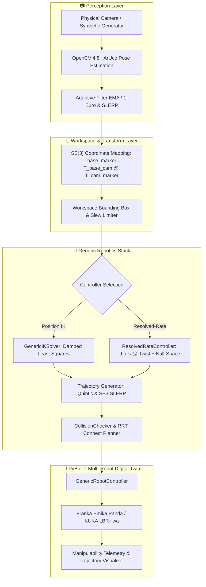

# VisionRobotTwin: Multi-Manipulator Vision-Guided Robotics Research Platform

> **Real-Time Vision-Guided Robotic Manipulation Digital Twin supporting Franka Emika Panda & KUKA LBR iiwa with Generic Kinematics, Resolved-Rate Control, Singularity Monitoring, Collision Planning, and Cross-Robot Benchmarking**

[](https://www.python.org/)
[](https://github.com/Tanishk756/VisionRobotTwin/releases/tag/v1.1.0)
[](LICENSE)
[](https://pybullet.org/)
[](https://opencv.org/)
[](https://github.com/Tanishk756/VisionRobotTwin/actions/workflows/tests.yml)

**Current Stable Release**: `v1.1.0` | **Development Branch**: `v1.2.0-dev` | **Maintainer**: [Tanishk Singhal](https://github.com/Tanishk756) ([tanisksinghal6285@gmail.com](mailto:tanisksinghal6285@gmail.com))

[Changelog](CHANGELOG.md) • [Validation Matrix](VALIDATION.md) • [Architecture](ARCHITECTURE.md) • [Portfolio Guide](PORTFOLIO.md) • [Authors](AUTHORS.md) • [Citation](CITATION.cff) • [Contributing](CONTRIBUTING.md) • [Security](SECURITY.md)

---

## 📌 Overview

**VisionRobotTwin** is a modular, robot-agnostic digital twin and robotics research platform in Python, OpenCV, and PyBullet. It enables closed-loop 6-DoF visual teleoperation and manipulation, generic forward/inverse kinematics, geometric Jacobian computation, manipulability analysis, resolved-rate differential Cartesian velocity control, collision checking, RRT-Connect motion planning, and reproducible cross-robot benchmarking.

The platform natively supports multiple 7-DoF industrial manipulators (**Franka Emika Panda** and **KUKA LBR iiwa**) with strongly typed capability specifications, preventing non-existent hardware features (e.g. grippers on standard arms) from causing runtime errors.

---

## 🤖 Supported Robot Matrix & Capabilities

| Capability | Franka Emika Panda | KUKA LBR iiwa |
| :--- | :---: | :---: |
| **Arm Degrees of Freedom** | 7-DoF Revolute | 7-DoF Revolute |
| **URDF Source** | `pybullet_data/franka_panda/panda.urdf` | `pybullet_data/kuka_iiwa/model.urdf` |
| **Manual Vision Tracking (3-DoF / 6-DoF)** | ✅ Supported | ✅ Supported |
| **Generic Forward Kinematics (FK)** | ✅ Supported | ✅ Supported |
| **Generic Inverse Kinematics (IK)** | ✅ Supported | ✅ Supported |
| **Geometric Jacobian ($6 \times 7$)** | ✅ Supported | ✅ Supported |
| **Yoshikawa Manipulability & SVD Condition** | ✅ Supported | ✅ Supported |
| **Resolved-Rate Velocity Control (DLS)** | ✅ Supported | ✅ Supported |
| **Null-Space Joint Centering** | ✅ Supported | ✅ Supported |
| **Collision-Aware RRT-Connect Planning** | ✅ Supported | ✅ Supported |
| **Quintic & SE(3) Trajectory Generation** | ✅ Supported | ✅ Supported |
| **End-Effector Gripper** | ✅ Yes (2-Finger Parallel) | ❌ No (Bare Flange) |
| **Autonomous Pick-and-Place FSM** | ✅ Supported | ❌ Disabled Cleanly |

---

## 🏗️ System Architecture



---

## 🔬 Core Robotics Algorithms

### 1. Geometric Jacobian & Manipulability
The spatial Jacobian $\mathbf{J}(\mathbf{q}) \in \mathbb{R}^{6 \times n}$ maps joint velocities to end-effector spatial twists:

$$\mathbf{v} = \begin{bmatrix} \mathbf{v}_{\text{linear}} \\ \boldsymbol{\omega}_{\text{angular}} \end{bmatrix} = \mathbf{J}(\mathbf{q}) \dot{\mathbf{q}}$$

Yoshikawa's manipulability measure $w(\mathbf{q})$ and Jacobian condition number $\kappa(\mathbf{J})$ are computed via Singular Value Decomposition (SVD):

$$w(\mathbf{q}) = \sqrt{\det(\mathbf{J} \mathbf{J}^T)} = \prod_{i=1}^6 \sigma_i, \quad \kappa(\mathbf{J}) = \frac{\sigma_{\max}}{\sigma_{\min}}$$

### 2. Adaptive Damped Least-Squares (DLS) Resolved-Rate Control
To prevent joint velocity explosion near kinematic singularities, the controller computes the regularized pseudoinverse:

$$\mathbf{J}_{\text{dls}} = \mathbf{J}^T (\mathbf{J} \mathbf{J}^T + \lambda^2 \mathbf{I})^{-1}$$

where damping factor $\lambda(\sigma_{\min})$ smoothly scales between $\lambda_{\min}$ and $\lambda_{\max}$ as $\sigma_{\min}$ approaches the singularity threshold.

### 3. Null-Space Redundancy Optimization
For 7-DoF redundant manipulators, secondary joint centering biases the arm towards its natural rest posture $\mathbf{q}_{\text{rest}}$ without disturbing the primary end-effector tracking task:

$$\dot{\mathbf{q}} = \mathbf{J}_{\text{dls}} \mathbf{v}_{\text{task}} + (\mathbf{I} - \mathbf{J}_{\text{dls}} \mathbf{J}) \left( -k_{\text{null}} \nabla H(\mathbf{q}) \right)$$

### 4. Collision-Aware RRT-Connect Motion Planning
When obstacles block the direct linear joint path, a bidirectional RRT-Connect planner searches joint space for collision-free trajectories, followed by randomized path shortcutting to remove redundant motion.

---

## 🚀 Installation & Quickstart (Windows)

### Prerequisites
- Windows 10 or Windows 11
- Python 3.10, 3.11, or 3.12
- Laptop Webcam or USB Camera (or `--synthetic` for offline simulation)

### Automated Setup
```powershell
git clone https://github.com/Tanishk756/VisionRobotTwin.git
cd VisionRobotTwin
setup.bat
```

---

## 🎮 CLI Usage & Multi-Robot Execution

### Robot Discovery & Model Inspection
```powershell
# List available registered robot models
python main.py --list-robots

# Inspect detailed Franka Panda specs (DoF, joint limits, reach, EE link)
python main.py --robot-info panda

# Inspect detailed KUKA LBR iiwa specs
python main.py --robot-info kuka_iiwa
```

### Running Simulations
```powershell
# Run Franka Panda with synthetic vision (default)
python main.py --robot panda --synthetic

# Run KUKA LBR iiwa with synthetic vision
python main.py --robot kuka_iiwa --synthetic

# Run with Resolved-Rate Cartesian Velocity Control
python main.py --robot panda --controller resolved-rate --synthetic

# Run with Obstacle Scene
python main.py --robot panda --scene obstacles --synthetic

# Run with Physical Webcam (Index 0)
python main.py --robot panda --camera 0
```

---

## 📊 Cross-Robot & Cross-Controller Benchmarking

### 1. Cross-Robot Benchmark Tool
Evaluates kinematics, manipulability, and planning across identical 3D target points:
```powershell
python tools/compare_robots.py --robots panda kuka_iiwa --headless
```
Artifacts are saved to `benchmarks/robot_comparison_YYYYMMDD_HHMMSS/` (`summary.json` and `results.csv`).

### 2. Cross-Controller Benchmark Tool
Compares Inverse Kinematics Position Control vs Resolved-Rate Jacobian Velocity Control:
```powershell
python tools/compare_controllers.py --robot panda --headless
```
Artifacts are saved to `benchmarks/controller_comparison_YYYYMMDD_HHMMSS/` (`summary.json` and `results.csv`).

---

## 🧪 Automated Testing & Verification Status

```powershell
pytest -v
```

| Test Suite | Focus Area | Status |
| :--- | :--- | :---: |
| `test_robot_registry.py` | Model Registry, Metadata, and Capabilities | **PASS** |
| `test_multi_robot_controller.py` | Generic Robot Controller, Panda & KUKA Loading | **PASS** |
| `test_multi_robot_ik.py` | Multi-Robot Inverse Kinematics & Limit Rejection | **PASS** |
| `test_jacobian.py` | Spatial Jacobian & Finite-Difference Verification | **PASS** |
| `test_manipulability.py` | Yoshikawa Index, SVD Condition, Singularity Warnings | **PASS** |
| `test_differential_ik.py` | Resolved-Rate Control, DLS Damping, Null-Space | **PASS** |
| `test_trajectory.py` | Joint Quintic Polynomials & Cartesian SE(3) SLERP | **PASS** |
| `test_collision.py` | Collision Queries, State Restoration, Allowed Contacts | **PASS** |
| `test_planning.py` | Direct Path Check, RRT-Connect, Path Shortcutting | **PASS** |
| `test_robot_benchmark.py` | Headless Cross-Robot & Cross-Controller Suites | **PASS** |
| `test_auto_integration.py` | End-to-End Autonomous Pick-and-Place FSM | **PASS** |
| `test_calibration_quality.py` | Camera Calibration Heuristics & Diagnostics | **PASS** |
| `test_extrinsics_math.py` | World-Anchor Extrinsic Calibration Math | **PASS** |
| `test_transforms.py` | SE(3) Lie Group Matrix & Quaternion Conversions | **PASS** |
| **Total Automated Tests** | **Full Multi-Robot Robotics Suite** | **98 / 98 PASSING** |

---

## 📂 Project Structure

```
VisionRobotTwin/
├── main.py                     # Main application entry point & CLI
├── config/                     # Centralized Strongly-Typed Settings
├── vision/                     # OpenCV Perception, ArUco, & Calibration
├── robotics/                   # Core Robotics Engine
│   ├── robot_model.py          # RobotModelSpec & RobotCapabilities dataclasses
│   ├── robot_registry.py       # RobotRegistry singleton (Panda, KUKA iiwa)
│   ├── robot_controller.py     # GenericRobotController & PandaRobotController
│   ├── inverse_kinematics.py   # GenericIKSolver & PandaIKSolver
│   ├── kinematics.py           # Geometric Jacobian, SVD Manipulability, DLS
│   ├── differential_ik.py      # ResolvedRateController with Null-Space Projection
│   ├── trajectory.py           # Joint Quintic Polynomial & Cartesian SE(3) SLERP
│   ├── collision.py            # CollisionChecker & State-Preserving Queries
│   ├── planning.py             # Bidirectional RRT-Connect & Path Shortcutting
│   ├── coordinate_transform.py # SE(3) Lie Group Transformations
│   ├── workspace_mapper.py     # Workspace Bounding & Slew Rate Limiting
│   ├── gripper.py              # Virtual Gripper Attachment Manager
│   ├── state_machine.py        # Perception-Gated Autonomous State Machine
│   ├── simulator.py            # PyBullet Environment & Multi-Robot Lifecycle
│   └── adapters/               # Robot-Specific Configurations (Panda, KUKA)
├── tools/                      # Benchmarking & Calibration CLI Tools
│   ├── compare_robots.py       # Cross-Robot Kinematics & Planning Benchmark
│   ├── compare_controllers.py  # IK vs Resolved-Rate Benchmark
│   ├── calibrate_camera.py     # Chessboard Intrinsic Calibration
│   ├── calibrate_extrinsics.py # World-Anchor Extrinsic Calibration
│   ├── benchmark_live.py       # Standstill & Dynamic Tracking Benchmark
│   └── generate_aruco_markers.py # Printable Marker Generator
└── tests/                      # 98 Unit & Integration Tests
```

---

## 📄 License

This project is licensed under the **MIT License** - see the [LICENSE](LICENSE) file for details.
