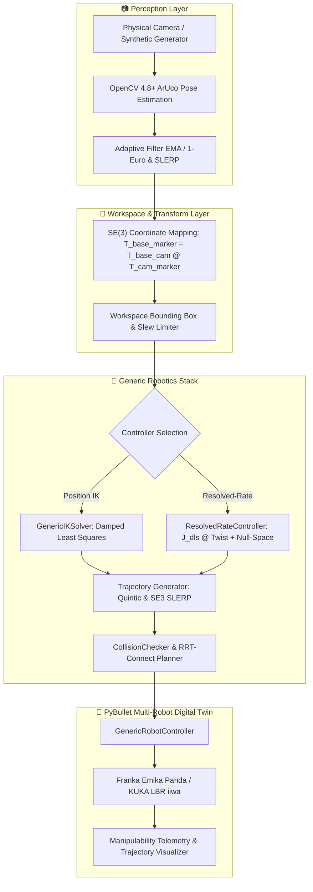

# VisionRobotTwin: Multi-Manipulator Vision-Guided Robotics Research Platform

> **Real-Time Vision-Guided Robotic Manipulation Digital Twin supporting Franka Emika Panda & KUKA LBR iiwa with Generic Kinematics, Resolved-Rate Control, Singularity Monitoring, Collision Planning, and Cross-Robot Benchmarking**

[](https://www.python.org/)
[](https://github.com/Tanishk756/VisionRobotTwin/releases/tag/v1.2.0)
[](LICENSE)
[](https://pybullet.org/)
[](https://opencv.org/)
[](https://github.com/Tanishk756/VisionRobotTwin/actions/workflows/tests.yml)

**Current Stable Release**: `v1.2.0` | **Development Branch**: `release/v1.2.0` | **Maintainer**: [Tanishk Singhal](https://github.com/Tanishk756) ([tanisksinghal6285@gmail.com](mailto:tanisksinghal6285@gmail.com))

[Changelog](CHANGELOG.md) • [Validation Matrix](VALIDATION.md) • [Architecture](ARCHITECTURE.md) • [Portfolio Guide](PORTFOLIO.md) • [Authors](AUTHORS.md) • [Citation](CITATION.cff) • [Contributing](CONTRIBUTING.md) • [Security](SECURITY.md)

---

## 📌 Overview

**VisionRobotTwin** is a robot-agnostic vision-guided manipulation and digital-twin research framework in Python, OpenCV, and PyBullet supporting:
- **Franka Emika Panda** and **KUKA LBR iiwa** (7-DoF manipulators)
- **Generic Forward Kinematics (FK)** and **Inverse Kinematics (IK)** with measured FK residuals
- **Geometric Spatial Jacobian** computation
- **Resolved-rate Cartesian velocity control** with adaptive Damped Least-Squares (DLS)
- **Yoshikawa manipulability and SVD singularity analysis**
- **Null-space joint centering** for kinematic redundancy resolution
- **Joint quintic polynomial** and **Cartesian SE(3) SLERP trajectories**
- **Self and environment collision checking** with simulation state preservation
- **Bidirectional RRT-Connect motion planning** with randomized path shortcutting
- **Reproducible task-space benchmarking suite** across standardized trajectories
- **Camera intrinsic and world-anchor extrinsic calibration tooling**

The platform natively supports multiple 7-DoF industrial manipulators with strongly typed capability specifications, preventing non-existent hardware features (e.g. grippers on standard arms) from causing runtime errors.

---

## 🤖 Supported Robot Matrix & Capabilities

| Capability | Franka Emika Panda | KUKA LBR iiwa |
| :--- | :---: | :---: |
| **7-DoF Arm** | ✅ YES | ✅ YES |
| **Vision Target Tracking** | ✅ YES | ✅ YES |
| **Generic IK** | ✅ YES | ✅ YES |
| **Resolved-Rate Control** | ✅ YES | ✅ YES |
| **Collision Planning** | ✅ YES | ✅ YES |
| **Gripper** | ✅ YES (2-Finger Parallel) | ❌ NO (Bare Flange) |
| **Autonomous Pick / Place** | ✅ YES | ❌ NO (Disabled Cleanly) |
| **URDF Source** | `pybullet_data/franka_panda/panda.urdf` | `pybullet_data/kuka_iiwa/model.urdf` |

---

## 🏗️ System Architecture



---

## 🔬 Core Robotics Algorithms

### 1. Geometric Jacobian & Manipulability
The spatial Jacobian $\mathbf{J}(\mathbf{q}) \in \mathbb{R}^{6 \times n}$ maps joint velocities to end-effector spatial twists:

$$\mathbf{v} = \begin{bmatrix} \mathbf{v}_{\text{linear}} \\ \boldsymbol{\omega}_{\text{angular}} \end{bmatrix} = \mathbf{J}(\mathbf{q}) \dot{\mathbf{q}}$$

Yoshikawa's manipulability measure $w(\mathbf{q})$ and Jacobian condition number $\kappa(\mathbf{J})$ are computed via Singular Value Decomposition (SVD):

$$w(\mathbf{q}) = \sqrt{\det(\mathbf{J} \mathbf{J}^T)} = \prod_{i=1}^6 \sigma_i, \quad \kappa(\mathbf{J}) = \frac{\sigma_{\max}}{\sigma_{\min}}$$

### 2. Adaptive Damped Least-Squares (DLS) Resolved-Rate Control
To prevent joint velocity explosion near kinematic singularities, the controller computes the regularized pseudoinverse:

$$\mathbf{J}_{\text{dls}} = \mathbf{J}^T (\mathbf{J} \mathbf{J}^T + \lambda^2 \mathbf{I})^{-1}$$

where damping factor $\lambda(\sigma_{\min})$ smoothly scales between $\lambda_{\min}$ and $\lambda_{\max}$ as $\sigma_{\min}$ approaches the singularity threshold.

### 3. Null-Space Redundancy Optimization
For 7-DoF redundant manipulators, secondary joint centering biases the arm towards its natural rest posture $\mathbf{q}_{\text{rest}}$ without disturbing the primary end-effector tracking task:

$$\dot{\mathbf{q}} = \mathbf{J}_{\text{dls}} \mathbf{v}_{\text{task}} + (\mathbf{I} - \mathbf{J}_{\text{dls}} \mathbf{J}) \left( -k_{\text{null}} \nabla H(\mathbf{q}) \right)$$

### 4. Collision-Aware RRT-Connect Motion Planning
When obstacles block the direct linear joint path, a bidirectional RRT-Connect planner searches joint space for collision-free trajectories, followed by randomized path shortcutting to remove redundant motion.

---

## 🚀 Installation & Quickstart (Windows)

### Prerequisites
- Windows 10 or Windows 11
- Python 3.10, 3.11, or 3.12
- Laptop Webcam or USB Camera (or `--synthetic` for offline simulation)

### Automated Setup
```powershell
git clone https://github.com/Tanishk756/VisionRobotTwin.git
cd VisionRobotTwin
setup.bat
```

---

## 🎮 CLI Usage & Multi-Robot Execution

### Robot Discovery & Model Inspection
```powershell
# List available registered robot models
python main.py --list-robots

# Inspect detailed Franka Panda specs (DoF, joint limits, reach, EE link)
python main.py --robot-info panda

# Inspect detailed KUKA LBR iiwa specs
python main.py --robot-info kuka_iiwa
```

### Running Simulations
```powershell
# Run Franka Panda with synthetic vision (default)
python main.py --robot panda --synthetic

# Run KUKA LBR iiwa with synthetic vision
python main.py --robot kuka_iiwa --synthetic

# Run with Resolved-Rate Cartesian Velocity Control
python main.py --robot panda --controller resolved-rate --synthetic

# Run with Obstacle Scene
python main.py --robot panda --scene obstacles --synthetic

# Run with Physical Webcam (Index 0)
python main.py --robot panda --camera 0
```

---

## 📊 Cross-Robot & Cross-Controller Benchmarking

### 1. Cross-Robot Benchmark Tool
Evaluates kinematics, manipulability, and planning across identical 3D target points:
```powershell
python tools/compare_robots.py --robots panda kuka_iiwa --headless
```
Artifacts are saved to `benchmarks/robot_comparison_YYYYMMDD_HHMMSS/` (`summary.json` and `results.csv`).

#### PyBullet Simulation Benchmark Results (15 Shared Reachable Targets)

| Benchmark Metric | Franka Emika Panda | KUKA LBR iiwa |
| :--- | :---: | :---: |
| **IK Solve Time (Mean / P95)** | 1.21 ms / 1.48 ms | 0.93 ms / 1.11 ms |
| **FK Measured IK Position Residual** | 1.22 mm | 20.82 mm |
| **Dynamic Position Error (Mean / P95)** | 19.72 mm / 128.72 mm | 23.81 mm / 154.03 mm |
| **Dynamic Orientation Error (Mean)** | 0.16 deg | 5.77 deg |
| **Yoshikawa Manipulability (Mean / Min)** | 0.0565 / 0.0377 | 0.0624 / 0.0510 |
| **RRT Planning Time / Success** | 26.84 ms (100%) | 59.00 ms (100%) |

### 2. Task-Space Research Experiment Suite & Benchmarking
A reproducible research-grade task-space benchmarking framework comparing Franka Emika Panda vs KUKA LBR iiwa across identical Cartesian trajectories in PyBullet:
```powershell
python tools/run_taskspace_experiments.py --all --repeats 3 --headless
```

#### Multi-Robot & Multi-Controller Reference Benchmark Matrix (PyBullet Simulation)

> [!NOTE]
> Under the v1.2 PyBullet reference configuration, 45 of 60 deterministic tracking trials satisfied the configured completion criteria. 15 KUKA IK trials did not satisfy the 10 mm completion threshold under this configuration due to numerical IK offsets, whereas Resolved-Rate velocity control achieved 100% completion success across all paths. Both reference obstacle-reach planning runs produced collision-free plans satisfying the explicit 25 mm endpoint criterion.

| Experiment | Metric | Panda (IK) | Panda (Resolved-Rate) | KUKA iiwa (IK) | KUKA iiwa (Resolved-Rate) |
| :--- | :--- | :---: | :---: | :---: | :---: |
| **Line (10 cm)** | **RMSE Pos** / **Joint Travel** | 2.02 mm / 0.36 rad | 10.23 mm / 0.38 rad | 20.45 mm / 0.28 rad | 11.02 mm / 0.28 rad |
| **Circle ($R=5\text{ cm}$)** | **RMSE Pos** / **Joint Travel** | 30.80 mm / 0.81 rad | 24.73 mm / 0.74 rad | 21.18 mm / 0.60 rad | 25.04 mm / 0.60 rad |
| **Figure Eight** | **RMSE Pos** / **Joint Travel** | 20.15 mm / 0.84 rad | 18.68 mm / 0.85 rad | 21.30 mm / 0.76 rad | 19.08 mm / 0.77 rad |
| **Waypoint Box** | **RMSE Pos** / **Joint Travel** | 15.53 mm / 0.58 rad | 19.07 mm / 0.59 rad | 21.06 mm / 0.44 rad | 19.45 mm / 0.44 rad |
| **SE3 Sweep ($\pm 20^\circ$)** | **RMSE Pos** / **Mean Orn** | 11.10 mm / 0.61 rad | **6.52 mm** / 0.80 rad | 20.68 mm / 0.43 rad | **7.68 mm** / 0.79 rad |

Full research report, plots, and methodology: [EXPERIMENTS.md](EXPERIMENTS.md) • [Reference Report](docs/experiments/v1.2_reference/REPORT.md)

---

## 🛡️ Validation & Tiered Status

VisionRobotTwin strictly distinguishes between automated unit verification, simulation benchmarks, and physical testing:

| Validation Tier | Environment | Status | Description |
| :--- | :--- | :---: | :--- |
| **Automated Software Validation** | GitHub Actions / Windows pytest | **`PASS` (131 / 131)** | Full unit, mathematical, and integration test suite across Python 3.11 & 3.12. |
| **PyBullet Reference Experiments** | 240 Hz Physics Twin | **`AVAILABLE`** | Reproducible multi-robot & multi-controller benchmark suite in PyBullet. |
| **Basic Physical Webcam Smoke** | Monocular Webcam Teleoperation | **`USER-CONFIRMED / PASS`** | Operator-verified ArUco marker teleoperation smoke test (v1.1 baseline). |
| **Physical Calibrated Camera Benchmark** | Chessboard Metric Rig | **`NOT YET MEASURED`** | Optical calibration metrics pending physical lab capture. |
| **Physical Panda / KUKA Hardware** | Physical Manipulator Arm | **`NOT TESTED`** | All robotics execution is validated strictly within simulation. |

---

## 🧪 Automated Testing & Verification Status

```powershell
pytest -v
```

| Test Suite | Focus Area | Status |
| :--- | :--- | :---: |
| `test_experiment_suite.py` | Task-Space Trajectories, Feasibility, Metrics, Headless Trials | **PASS** |
| `test_robot_registry.py` | Model Registry, Metadata, and Capabilities | **PASS** |
| `test_multi_robot_controller.py` | Generic Robot Controller, Panda & KUKA Loading | **PASS** |
| `test_multi_robot_ik.py` | Multi-Robot Inverse Kinematics & Limit Rejection | **PASS** |
| `test_jacobian.py` | Spatial Jacobian & Finite-Difference Verification | **PASS** |
| `test_manipulability.py` | Yoshikawa Index, SVD Condition, Singularity Warnings | **PASS** |
| `test_differential_ik.py` | Resolved-Rate Control, DLS Damping, Null-Space | **PASS** |
| `test_trajectory.py` | Joint Quintic Polynomials & Cartesian SE(3) SLERP | **PASS** |
| `test_collision.py` | Self-Collision Queries, State Restoration, Allowed Contacts | **PASS** |
| `test_planning.py` | Direct Path Check, RRT-Connect, Impossible Scene | **PASS** |
| `test_runtime_integration.py` | MotionManager, Rate Limiter, FK Residual, Controller Selection | **PASS** |
| `test_robot_benchmark.py` | Headless Cross-Robot & Cross-Controller Suites | **PASS** |
| `test_auto_integration.py` | End-to-End Autonomous Pick-and-Place FSM | **PASS** |
| `test_calibration_quality.py` | Camera Calibration Heuristics & Diagnostics | **PASS** |
| `test_extrinsics_math.py` | World-Anchor Extrinsic Calibration Math | **PASS** |
| `test_transforms.py` | SE(3) Lie Group Matrix & Quaternion Conversions | **PASS** |
| **Total Automated Tests** | **Full Multi-Robot Robotics Suite** | **131 / 131 PASSING** |

---

## 📂 Project Structure

```
VisionRobotTwin/
├── main.py                     # Main application entry point & CLI
├── config/                     # Centralized Strongly-Typed Settings
├── vision/                     # OpenCV Perception, ArUco, & Calibration
├── robotics/                   # Core Robotics Engine
│   ├── robot_model.py          # RobotModelSpec & RobotCapabilities dataclasses
│   ├── robot_registry.py       # RobotRegistry singleton (Panda, KUKA iiwa)
│   ├── robot_controller.py     # GenericRobotController (Position Rate Limiting)
│   ├── inverse_kinematics.py   # GenericIKSolver (FK Residual Measurement)
│   ├── kinematics.py           # Geometric Jacobian, SVD Manipulability, DLS
│   ├── differential_ik.py      # ResolvedRateController with Null-Space Projection
│   ├── motion_manager.py       # MotionManager runtime planning & execution layer
│   ├── trajectory.py           # Joint Quintic Polynomial & Cartesian SE(3) SLERP
│   ├── collision.py            # CollisionChecker (True Self-Collision Queries)
│   ├── planning.py             # Bidirectional RRT-Connect (Explicit Root Tracking)
│   ├── coordinate_transform.py # SE(3) Lie Group Transformations
│   ├── workspace_mapper.py     # Workspace Bounding & Slew Rate Limiting
│   ├── gripper.py              # Virtual Gripper Attachment Manager
│   ├── state_machine.py        # Perception-Gated Autonomous State Machine
│   ├── simulator.py            # PyBullet Environment & Multi-Robot Lifecycle
│   └── adapters/               # Robot-Specific Configurations (Panda, KUKA)
├── tools/                      # Benchmarking & Calibration CLI Tools
│   ├── compare_robots.py       # Cross-Robot Kinematics & Planning Benchmark
│   ├── compare_controllers.py  # IK vs Resolved-Rate Benchmark
│   ├── run_taskspace_experiments.py # Reproducible Task-Space Experiment Suite
│   ├── calibrate_camera.py     # Chessboard Intrinsic Calibration
│   ├── calibrate_extrinsics.py # World-Anchor Extrinsic Calibration
│   ├── benchmark_live.py       # Standstill & Dynamic Tracking Benchmark
│   └── generate_aruco_markers.py # Printable Marker Generator
└── tests/                      # 131 Automated Unit & Integration Tests
```

---

## 📄 License

This project is licensed under the **MIT License** - see the [LICENSE](LICENSE) file for details.
