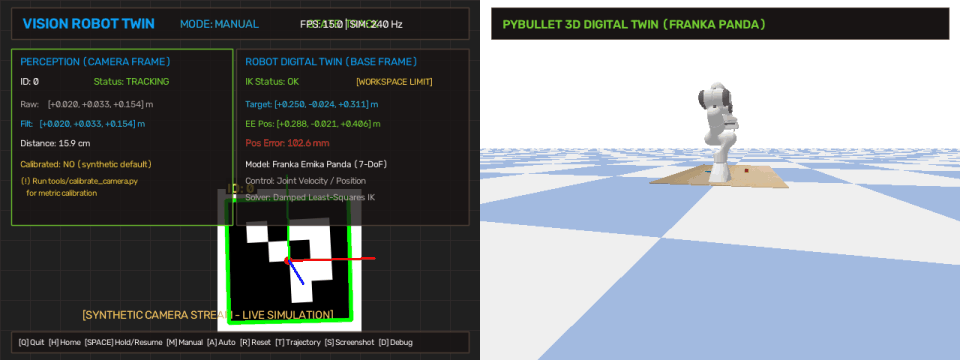
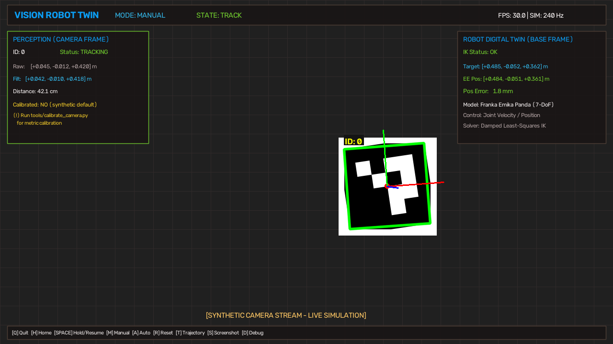
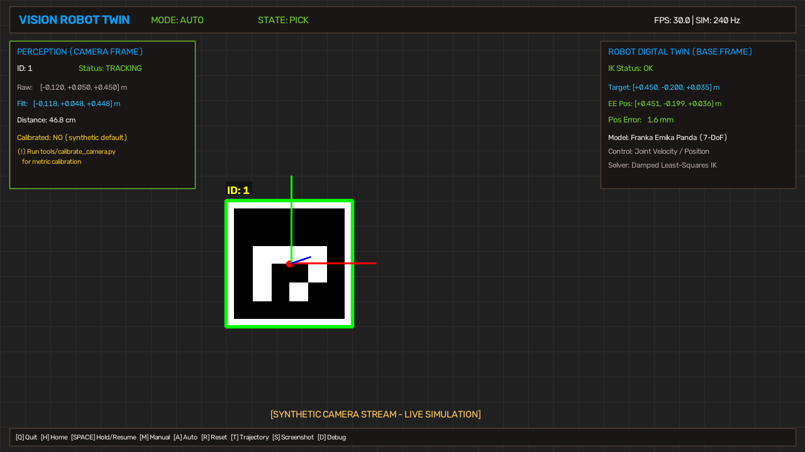
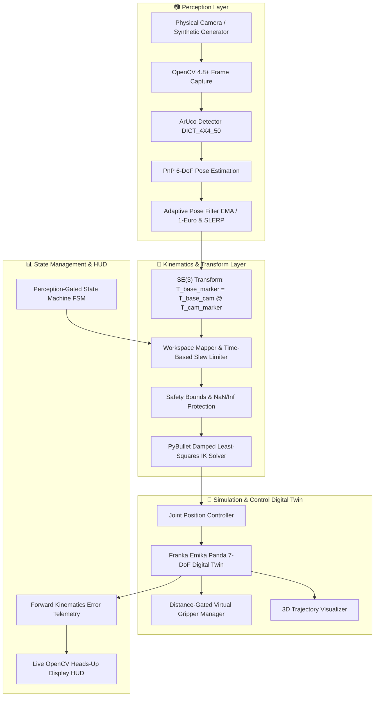

# VisionRobotTwin: Real-Time Vision-Guided Robotic Manipulator Digital Twin

> **Real-Time 6-DoF Vision-Guided Robotic Manipulation using ArUco Pose Estimation, Inverse Kinematics, and PyBullet Physics**

[](https://www.python.org/)
[](https://github.com/Tanishk756/VisionRobotTwin/releases/tag/v1.1.0)
[](LICENSE)
[](https://pybullet.org/)
[](https://opencv.org/)
[](https://github.com/Tanishk756/VisionRobotTwin/actions/workflows/tests.yml)

**Current Release**: `v1.1.0` (Latest Stable) | **Active Development**: `v1.2.0-dev` | **Maintainer**: [Tanishk Singhal](https://github.com/Tanishk756) ([tanisksinghal6285@gmail.com](mailto:tanisksinghal6285@gmail.com))

[Changelog](CHANGELOG.md) • [Validation Matrix](VALIDATION.md) • [Architecture](ARCHITECTURE.md) • [Portfolio Guide](PORTFOLIO.md) • [Authors](AUTHORS.md) • [Citation](CITATION.cff) • [Contributing](CONTRIBUTING.md) • [Security](SECURITY.md)

---

## 📌 Overview

**VisionRobotTwin** is a real-time, closed-loop vision-guided robotics software system that connects a webcam video stream to a high-fidelity **Franka Emika Panda (7-DoF)** digital twin simulated in **PyBullet**.

A physical or synthetic **ArUco marker** is detected in 3D space, its 6-DoF metric pose is estimated using camera intrinsics and Perspective-n-Point (PnP), filtered to eliminate high-frequency sensor noise, transformed across rigid coordinate frames ($SE(3)$), mapped and clamped into the reachable robot workspace, and resolved into 7-DoF joint position commands via numerical **Damped Least-Squares Inverse Kinematics (IK)**.

### Features & Capabilities:
1. **Manual Teleoperation Tracking Mode**: The Franka Panda end-effector tracks physical ArUco marker translation and orientation in real time.
2. **Autonomous Pick-and-Place Mode**: A perception-gated finite state machine coordinates multi-frame target stabilization, approach, descent, physical distance-gated virtual grasping, elevation, transfer, and release between detected target markers.
3. **World-Anchor Extrinsic Calibration (v1.2)**: Solves direct Camera-to-Robot base transformation $\mathbf{T}_{\text{robot}\to\text{camera}} = \mathbf{T}_{\text{robot}\to\text{anchor}} \cdot \mathbf{T}_{\text{camera}\to\text{anchor}}^{-1}$ via dedicated ArUco World Anchor Marker ID 10.
4. **Reproducible Benchmark Suite V2 (v1.2)**: Stationary standstill optical jitter analysis and dynamic tracking benchmark with timestamped artifacts (`benchmarks/YYYYMMDD_HHMMSS/`) and system manifest.
5. **Physical Demo Video & Snapshot Recording (v1.2)**: Record demo sessions to MP4/AVI and save timestamped snapshots with adjacent JSON metadata.

---

## 📸 Demonstrations & Visual Overview

### Synthetic End-to-End Simulation Demo (15s Digital Twin Session)


*Left: Real-time OpenCV HUD with ArUco 6-DoF tracking, filtering, and telemetry. Right: PyBullet 3D Franka Panda physics digital twin with trajectory visualizer.*

---

### High-Resolution Snapshots

| Manual 6-DoF Teleoperation Tracking | Autonomous Pick & Place Sequence |
| :---: | :---: |
|  |  |
| *OpenCV HUD showing 6-DoF pose estimation, filtering, workspace mapping, and Franka Panda digital twin tracking.* | *Autonomous State Machine executing perception-gated approach, descent, distance-validated grasp, lift, transfer, and place.* |

---

## 🏗️ System Architecture



---

## 📐 Coordinate Frames & Transformation Mathematics

The rigid-body transformation pipeline uses homogeneous $SE(3)$ representations:

$$\mathbf{T} = \begin{bmatrix} \mathbf{R} & \mathbf{t} \\ \mathbf{0}_{1\times3} & 1 \end{bmatrix} \in SE(3), \quad \mathbf{R} \in SO(3), \quad \mathbf{t} \in \mathbb{R}^3$$

### Coordinate Frames:
- **$\mathcal{F}_C$ (Camera Optical Frame)**: $+X$ right, $+Y$ down, $+Z$ optical depth into scene.
- **$\mathcal{F}_M$ (ArUco Marker Frame)**: Local planar frame centered at marker origin.
- **$\mathcal{F}_B$ (Robot Base Frame)**: $+X$ forward, $+Y$ left, $+Z$ vertical upward.
- **$\mathcal{F}_E$ (End-Effector Flange Frame)**: Tool center point (TCP) at `panda_grasptarget` (Link 11).

### Transformation Modes:
- **`relative` mode (default)**: Intuitive teleoperation mapping Cartesian displacements relative to interaction center.
- **`se3` mode**: Computes direct rigid transformation using nominal or world-anchor calibrated camera-to-robot extrinsics ($\mathbf{T}_{B \to M} = \mathbf{T}_{B \to C} \cdot \mathbf{T}_{C \to M}$).

---

## 🚀 Installation & Quickstart (Windows)

### Prerequisites
- Windows 10 or Windows 11
- Python 3.10, 3.11, or 3.12
- Laptop Webcam or USB Camera (or use `--synthetic` for offline simulation)

### Automated Setup
Clone the repository and run the automated setup script:
```powershell
git clone https://github.com/Tanishk756/VisionRobotTwin.git
cd VisionRobotTwin
setup.bat
```

### Manual Setup
```powershell
# 1. Create and activate virtual environment
python -m venv .venv
.\.venv\Scripts\activate.bat

# 2. Upgrade pip and install dependencies
python -m pip install --upgrade pip
python -m pip install -r requirements-dev.txt

# 3. Generate ArUco marker assets
python tools\generate_aruco_markers.py

# 4. Run automated test suite
pytest -v
```

---

## 🖨️ Marker Generation & Roles

Run the marker generator to create printable fiducials in `assets/markers/`:
```powershell
python tools\generate_aruco_markers.py
```

| Marker ID | Role | Semantic Purpose |
| :---: | :---: | :--- |
| **ID 0** | `MANUAL TARGET` | Controls Franka Panda end-effector in Manual Tracking Mode |
| **ID 1** | `PICK LOCATION` | Sets Cartesian target for Autonomous Pick phase |
| **ID 2** | `PLACE LOCATION` | Sets Cartesian target for Autonomous Place phase |
| **ID 10** | `WORLD ANCHOR` | Physical calibration anchor for Camera-to-Robot Extrinsics |

---

## 🎯 Vision Calibration Tools

### 1. Camera Intrinsic Calibration & Quality Reports
Calibrate camera intrinsics using a standard $9 \times 6$ chessboard ($25\text{ mm}$ square size):
```powershell
python tools\calibrate_camera.py --camera 0 --cols 9 --rows 6 --square-size 0.025
```
Outputs `calibration/camera_calibration.npz`, `calibration/camera_calibration_report.json` (OpenCV RMS, mean error, diversity score), and `calibration/calibration_diagnostics.png`.

### 2. World-Anchor Camera-to-Robot Extrinsic Calibration
Calibrate camera mounting extrinsics relative to the virtual Franka base using Marker ID 10:
```powershell
python tools\calibrate_extrinsics.py --camera 0 --marker-id 10 --samples 30
```
Outputs `calibration/extrinsics.json` containing $\mathbf{T}_{\text{robot}\to\text{camera}}$, translation standard deviation (mm), and rotation dispersion (deg).

### 3. Extrinsic Validation Tool
```powershell
python tools\validate_extrinsics.py --camera 0 --marker-id 10
```
Measures live anchor point residual translation error (mm) and orientation error (deg).

### 4. Calibration Status Inspection
```powershell
python main.py --calibration-status
```

---

## 🎮 Running the Application

### Launching Options
```powershell
# Launch with physical camera (Index 0, Manual Mode)
python main.py --camera 0

# Launch in Autonomous Pick-and-Place Mode (Perception-gated)
python main.py --mode auto

# Launch with SE(3) Calibrated Extrinsics
python main.py --camera 0 --transform-mode se3

# Launch with Session Video Recording
python main.py --camera 0 --record

# Launch in Synthetic Simulation Mode (offline testing)
python main.py --synthetic

# Launch in Bounded Headless Mode (CI automated validation)
python main.py --synthetic --headless --max-frames 120
```

### Keyboard Controls

| Key | Action | Description |
| :---: | :---: | :--- |
| **`Q` / `ESC`** | **Quit** | Gracefully disconnects PyBullet, releases camera, closes windows |
| **`H`** | **Home** | Resets manipulator to safe default joint configuration |
| **`SPACE`** | **Hold / Resume** | Pauses robot motion and holds current target pose |
| **`M`** | **Manual Mode** | Activates live marker teleoperation |
| **`A`** | **Auto Mode** | Initiates perception-gated Pick-and-Place sequence |
| **`R`** | **Reset** | Resets simulation objects, grasp constraints, and state machine |
| **`T`** | **Toggle Trajectory** | Toggles 3D end-effector trailing line visualizer |
| **`S`** | **Screenshot** | Saves timestamped snapshots and adjacent JSON metadata |
| **`D`** | **Debug** | Toggles verbose debugging telemetry |
| **`C`** | **Calibration Info** | Prints camera intrinsics and extrinsics status |

---

## 📊 Benchmarking Suite V2

Run physical or synthetic reproducible benchmark sessions:
```powershell
# Stationary Standstill Jitter Benchmark (Place Marker 0 still)
python tools/benchmark_live.py --camera 0 --duration 10.0 --benchmark-mode stationary

# Dynamic Motion Tracking Benchmark
python tools/benchmark_live.py --camera 0 --duration 15.0 --benchmark-mode tracking
```
Artifacts are saved to `benchmarks/YYYYMMDD_HHMMSS/` containing `summary.json`, `frames.csv`, and diagnostic plots.

---

## 🧪 Automated Testing & Verification Status

```powershell
pytest -v
```

| Subsystem / Test Suite | Status | Test Coverage |
| :--- | :---: | :--- |
| **Transform Math & Lie Groups** | **PASS** | `test_transforms.py`, `test_extrinsics_math.py` |
| **Calibration Quality & IO** | **PASS** | `test_calibration_quality.py`, `test_extrinsics_io.py`, `test_pose_aggregation.py` |
| **Pose Filtering & SLERP** | **PASS** | `test_filters.py` |
| **Workspace & Cartesian Safety**| **PASS** | `test_workspace.py` |
| **IK Solver & Limit Rejection** | **PASS** | `test_ik_and_robot.py` |
| **State Machine Autonomy** | **PASS** | `test_state_machine.py`, `test_auto_integration.py` |
| **Benchmark Suite V2 Pipeline** | **PASS** | `test_benchmark_v2.py`, `test_benchmark_pipeline.py` |
| **Demo Recording & Metadata** | **PASS** | `test_demo_and_snapshots.py` |
| **Physics Scheduling Clock** | **PASS** | `test_simulation_clock.py` |
| **Logging & Operator Context** | **PASS** | `test_logger.py`, `test_pause_and_context.py` |
| **Version & Packaging** | **PASS** | `test_version.py` |
| **Total Automated Tests** | **PASS** | **68 / 68 passing** |

*See [VALIDATION.md](VALIDATION.md) for full subsystem audit details.*

---

## 📂 Project Directory Tree

```
VisionRobotTwin/
│
├── main.py                     # Main application entry point & perception-control loop
├── visionrobottwin_version.py  # Canonical package version definition (1.2.0-dev)
├── requirements.txt            # Production dependencies
├── requirements-dev.txt        # Development and testing dependencies
├── pytest.ini                  # Pytest configuration
├── setup.bat                   # Automated Windows environment setup script
├── run.bat                     # Windows application launcher script
├── README.md                   # Comprehensive project documentation
├── ARCHITECTURE.md             # Deep-dive systems architecture and math specification
├── PORTFOLIO.md                # Robotics portfolio, interview Q&A, and resume guide
├── VALIDATION.md               # Strict validation report and subsystem matrix
├── CHANGELOG.md                # Semantic version changelog
├── RELEASE_NOTES_v1.1.0.md     # Formal release notes
├── AUTHORS.md                  # Author and maintainer attribution
├── CITATION.cff                # Academic and project citation metadata
├── CONTRIBUTING.md             # Community contribution guidelines
├── SECURITY.md                 # Security and simulation safety policy
├── LICENSE                     # MIT Open-Source License
├── .gitignore                  # Git ignore rules
│
├── .github/workflows/          # GitHub Actions CI Workflows
│   └── tests.yml               # Automated multi-Python test runner (Windows Python 3.11/3.12)
│
├── config/                     # Centralized Strongly-Typed Settings
│   ├── __init__.py
│   └── settings.py             # Dataclasses for Camera, ArUco, Robot, Sim, Workspace
│
├── vision/                     # Computer Vision & Pose Estimation
│   ├── __init__.py
│   ├── camera.py               # Hardware camera capture & synthetic frame fallback
│   ├── aruco_detector.py       # OpenCV 4.8+ ArUco detection & 2D rendering
│   ├── pose_estimator.py       # 6-DoF Perspective-n-Point (PnP) pose solver
│   └── calibration.py          # Camera intrinsics loader & pinhole model generator
│
├── robotics/                   # Robotics Kinematics, Control, & Simulation
│   ├── __init__.py
│   ├── coordinate_transform.py # SE(3) Lie group homogeneous matrices & conversions
│   ├── workspace_mapper.py     # Cartesian mapping, boundary clamping, relative orientation reference
│   ├── inverse_kinematics.py   # PyBullet Damped Least-Squares IK solver & limit rejection
│   ├── robot_controller.py     # Franka Panda URDF inspector & joint controller
│   ├── simulator.py            # PyBullet physics manager, targets & trajectory lines
│   ├── gripper.py              # Distance-gated virtual gripper & constraint manager
│   └── state_machine.py        # Perception-gated Finite State Machine & bounded buffers
│
├── utils/                      # Utilities & Monitoring
│   ├── __init__.py
│   ├── simulation_clock.py     # Fixed-step accumulator physics scheduler
│   ├── filters.py              # EMA filter, 1 Euro adaptive filter, Quaternion SLERP
│   ├── telemetry.py            # Live OpenCV HUD overlay renderer
│   ├── logger.py               # Hierarchical structured application logger
│   └── fps_counter.py          # Real-time sliding window FPS counter
│
├── tools/                      # Standalone CLI Utilities
│   ├── generate_aruco_markers.py # Printable marker and card generator
│   ├── calibrate_camera.py     # Interactive chessboard calibration tool (RMS error px)
│   ├── benchmark_live.py       # Physical & synthetic benchmark tool
│   └── generate_demo_gif.py    # Automated demo GIF recorder
│
├── assets/markers/             # Printable PNG marker images
├── calibration/                # Camera Calibration Storage (.npz)
├── screenshots/                # Captured HUD and simulation snapshots
├── demo/                       # 15-second animated demonstration GIF
└── tests/                      # Comprehensive Unit & Integration Test Suite (49 tests)
    ├── test_auto_integration.py
    ├── test_benchmark_pipeline.py
    ├── test_camera.py
    ├── test_filters.py
    ├── test_gripper_physics.py
    ├── test_headless_integration.py
    ├── test_ik_and_robot.py
    ├── test_logger.py
    ├── test_pause_and_context.py
    ├── test_pose_utils.py
    ├── test_simulation_clock.py
    ├── test_state_machine.py
    ├── test_transforms.py
    ├── test_version.py
    └── test_workspace.py
```

---

## 📄 License

This project is licensed under the **MIT License** - see the [LICENSE](LICENSE) file for details.
