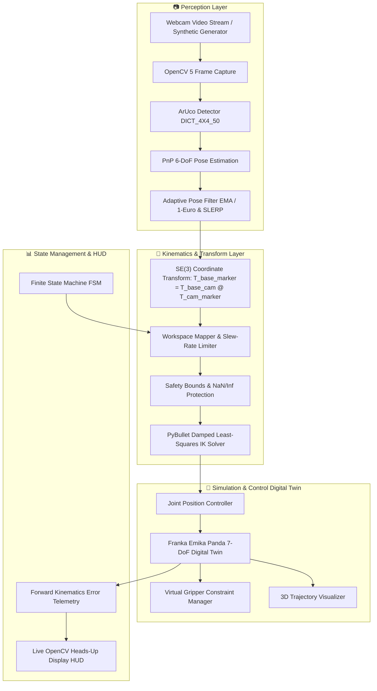

# VisionRobotTwin: Real-Time Vision-Guided Robotic Manipulator Digital Twin

> **Real-Time 6-DoF Vision-Guided Robotic Manipulation using ArUco Pose Estimation, Inverse Kinematics, and PyBullet Physics**

[](https://www.python.org/)
[](LICENSE)
[](https://pybullet.org/)
[](https://opencv.org/)
[]()

---

## 📌 Overview

**VisionRobotTwin** is a real-time, closed-loop vision-guided robotics software system that connects a physical webcam video stream to a high-fidelity **Franka Emika Panda (7-DoF)** digital twin simulated in **PyBullet**. 

A physical or synthetic **ArUco marker** is detected in 3D space, its 6-DoF metric pose is estimated using camera intrinsics and Perspective-n-Point (PnP), filtered to eliminate high-frequency sensor noise, transformed across rigid coordinate frames ($SE(3)$), mapped and clamped into the reachable robot workspace, and resolved into 7-DoF joint position commands via numerical **Damped Least-Squares Inverse Kinematics (IK)**.

The system features:
1. **Manual Teleoperation Tracking Mode**: The Franka Panda end-effector tracks physical ArUco marker translation and depth in real time.
2. **Autonomous Pick-and-Place Mode**: A finite state machine coordinates waypoint generation, descent, rigid virtual grasp constraints, elevation, translation, and release between physical/simulated target markers.

---

## 📸 Demonstrations & Visual Overview

### Live System Execution (15s Side-by-Side Digital Twin)


*Left: Real-time OpenCV HUD with ArUco 6-DoF tracking, filtering, and telemetry. Right: PyBullet 3D Franka Panda physics digital twin with trajectory visualizer.*

---

### Static High-Resolution Snapshots

| Manual 6-DoF Teleoperation Tracking | Autonomous Pick & Place Sequence |
| :---: | :---: |
|  |  |
| *OpenCV HUD showing 6-DoF pose estimation, filtering, workspace mapping, and Franka Panda digital twin tracking.* | *Autonomous State Machine executing approach, descend, virtual grasp, lift, transfer, and place.* |

---

## 🏗️ System Architecture



---

## 📐 Coordinate Frames & Transformation Mathematics

The rigid-body transformation pipeline uses homogeneous $SE(3)$ representations:

$$\mathbf{T} = \begin{bmatrix} \mathbf{R} & \mathbf{t} \\ \mathbf{0}_{1\times3} & 1 \end{bmatrix} \in SE(3), \quad \mathbf{R} \in SO(3), \quad \mathbf{t} \in \mathbb{R}^3$$

### Coordinate Frames:
- **$\mathcal{F}_C$ (Camera Optical Frame)**: $+X$ right, $+Y$ down, $+Z$ optical depth into scene.
- **$\mathcal{F}_M$ (ArUco Marker Frame)**: Local planar frame centered at marker origin.
- **$\mathcal{F}_B$ (Robot Base Frame)**: $+X$ forward, $+Y$ left, $+Z$ vertical upward.
- **$\mathcal{F}_E$ (End-Effector Flange Frame)**: Tool center point (TCP) at `panda_grasptarget` (Link 11).

### Transformation Chain:
$$\mathbf{T}_{B \to M} = \mathbf{T}_{B \to C} \cdot \mathbf{T}_{C \to M}$$

Analytical matrix inversion ensures exact frame composition:
$$\mathbf{T}^{-1} = \begin{bmatrix} \mathbf{R}^T & -\mathbf{R}^T \mathbf{t} \\ \mathbf{0}_{1\times3} & 1 \end{bmatrix}$$

---

## 🚀 Installation & Quickstart (Windows)

### Prerequisites
- Windows 10 or Windows 11
- Python 3.10, 3.11, or 3.12
- Laptop Webcam or USB Camera (optional: synthetic simulation runs automatically if no camera is detected)

### Automated Setup
Clone the repository and run the automated setup script:
```powershell
git clone https://github.com/your-username/VisionRobotTwin.git
cd VisionRobotTwin
setup.bat
```

### Manual Setup
```powershell
# 1. Create and activate virtual environment
python -m venv .venv
.\.venv\Scripts\activate.bat

# 2. Upgrade pip and install dependencies
python -m pip install --upgrade pip
python -m pip install -r requirements-dev.txt

# 3. Generate ArUco marker assets
python tools\generate_aruco_markers.py

# 4. Run automated test suite
pytest -v
```

---

## 🖨️ Marker Generation & Roles

Run the marker generator to create printable fiducials in `assets/markers/`:
```powershell
python tools\generate_aruco_markers.py
```

| Marker ID | Role | Semantic Purpose |
| :---: | :---: | :--- |
| **ID 0** | `MANUAL TARGET` | Controls Franka Panda end-effector position in Manual Tracking Mode |
| **ID 1** | `PICK LOCATION` | Sets Cartesian target for Autonomous Pick phase |
| **ID 2** | `PLACE LOCATION` | Sets Cartesian target for Autonomous Place phase |

*A combined printable reference sheet is saved to `assets/markers/all_markers_sheet.png`.*

---

## 🎯 Camera Calibration Procedure

For metric 6-DoF pose accuracy, calibrate your camera using a standard $9 \times 6$ chessboard:
```powershell
python tools\calibrate_camera.py --camera 0 --cols 9 --rows 6 --square-size 0.025
```
- Hold the chessboard pattern in front of the camera at multiple angles and depths.
- Press `[SPACE]` when the pattern is highlighted in green (capture 15–20 frames).
- Press `[C]` to compute intrinsics and save to `calibration/camera_calibration.npz`.
- *If no calibration file exists, the system automatically uses a default pinhole model and informs the operator via the HUD.*

---

## 🎮 Running the Application

### Launching
```powershell
# Launch with default settings (Manual Mode, Camera 0)
python main.py

# Launch in Autonomous Pick-and-Place Mode
python main.py --mode auto

# Launch in Synthetic Simulation Mode (without physical camera)
python main.py --synthetic

# Launch with CSV Telemetry Recording
python main.py --record-data
```

### Keyboard Controls

| Key | Action | Description |
| :---: | :---: | :--- |
| **`Q` / `ESC`** | **Quit** | Gracefully disconnects PyBullet, releases camera, closes windows |
| **`H`** | **Home** | Resets manipulator to safe default joint configuration |
| **`SPACE`** | **Hold / Resume** | Pauses robot motion and holds current target pose |
| **`M`** | **Manual Mode** | Activates live 6-DoF marker teleoperation |
| **`A`** | **Auto Mode** | Initiates autonomous Pick-and-Place state sequence |
| **`R`** | **Reset** | Resets simulation objects, grasp constraints, and filters |
| **`T`** | **Toggle Trajectory** | Toggles 3D end-effector trailing line visualizer |
| **`S`** | **Screenshot** | Saves timestamped snapshots of both Camera HUD and PyBullet window |
| **`D`** | **Debug** | Toggles verbose debugging telemetry |
| **`C`** | **Calibration Info** | Prints camera intrinsics matrix and principal point to console |

---

## 🧪 Automated Testing

The project includes unit and integration tests covering transforms, filters, workspace safety, FSM transitions, and IK:
```powershell
pytest -v
```

### Test Suite Summary:
- `test_transforms.py`: Orthogonality of $SO(3)$, Euler/Quaternion roundtrips, $SE(3)$ matrix inversion, transform composition.
- `test_filters.py`: Exponential moving average convergence, noise reduction, 1-Euro adaptive cutoff, quaternion SLERP.
- `test_workspace.py`: Workspace boundary clamping, axis mapping, slew-rate displacement limiting, NaN/Inf protection.
- `test_state_machine.py`: Marker tracking acquisition, lost-tracking timeout recovery, autonomous pick-and-place sequence.
- `test_pose_utils.py`: Pinhole intrinsic model, ArUco detection, metric PnP pose solver.
- `test_ik_and_robot.py`: Headless PyBullet IK convergence and Panda joint position controller.

---

## 📂 Project Directory Tree

```
VisionRobotTwin/
│
├── main.py                     # Main application entry point & perception-control loop
├── requirements.txt            # Production dependencies
├── requirements-dev.txt        # Development and testing dependencies
├── pytest.ini                  # Pytest configuration
├── setup.bat                   # Automated Windows environment setup script
├── run.bat                     # Windows application launcher script
├── README.md                   # Comprehensive project documentation
├── ARCHITECTURE.md             # Deep-dive systems architecture and math specification
├── PORTFOLIO.md                # Robotics portfolio, interview Q&A, and resume guide
├── LICENSE                     # MIT Open-Source License
├── .gitignore                  # Git ignore rules
│
├── config/                     # Centralized Strongly-Typed Settings
│   ├── __init__.py
│   └── settings.py             # Dataclasses for Camera, ArUco, Robot, Sim, Workspace
│
├── vision/                     # Computer Vision & Pose Estimation
│   ├── __init__.py
│   ├── camera.py               # Hardware camera capture & synthetic frame fallback
│   ├── aruco_detector.py       # OpenCV 5 ArUco detection & 2D rendering
│   ├── pose_estimator.py       # 6-DoF Perspective-n-Point (PnP) pose solver
│   └── calibration.py          # Camera intrinsics loader & pinhole model generator
│
├── robotics/                   # Robotics Kinematics, Control, & Simulation
│   ├── __init__.py
│   ├── coordinate_transform.py # SE(3) Lie group homogeneous matrices & conversions
│   ├── workspace_mapper.py     # Cartesian mapping, boundary clamping, slew-rate limiter
│   ├── inverse_kinematics.py   # PyBullet Damped Least-Squares IK solver
│   ├── robot_controller.py     # Franka Panda URDF inspector & joint controller
│   ├── simulator.py            # PyBullet physics manager, targets & trajectory lines
│   ├── gripper.py              # Virtual gripper & rigid grasp constraint manager
│   └── state_machine.py        # Finite State Machine (HOME, SEARCH, TRACK, PICK, PLACE)
│
├── utils/                      # Utilities & Monitoring
│   ├── __init__.py
│   ├── filters.py              # EMA filter, 1 Euro adaptive filter, Quaternion SLERP
│   ├── telemetry.py            # Live OpenCV HUD overlay renderer
│   ├── logger.py               # Structured application logger
│   └── fps_counter.py          # Real-time sliding window FPS counter
│
├── tools/                      # Standalone CLI Utilities
│   ├── generate_aruco_markers.py # Printable marker and card generator
│   └── calibrate_camera.py     # Interactive chessboard calibration tool
│
├── assets/                     # Assets & Generated Marker Cards
│   └── markers/                # Printable PNG marker images
│
├── calibration/                # Camera Calibration Storage (.npz)
├── screenshots/                # Captured HUD and simulation snapshots
├── demo/data/                  # Recorded telemetry CSV session logs
└── tests/                      # Unit & Integration Test Suite
    ├── test_transforms.py
    ├── test_filters.py
    ├── test_workspace.py
    ├── test_state_machine.py
    ├── test_pose_utils.py
    └── test_ik_and_robot.py
```

---

## 🧠 Robotics & Computer Vision Concepts Demonstrated

- **$SE(3)$ Rigid Body Kinematics**: Homogeneous transformation matrices, Lie group formulations, analytical inversion, frame chaining.
- **Perspective-n-Point (PnP)**: Closed-form planar square fiducial pose estimation using `cv2.solvePnP` with IPPE_SQUARE and iterative Levenberg-Marquardt.
- **Inverse Kinematics (IK)**: Numerical damped least-squares resolving desired Cartesian end-effector targets into 7-DoF joint angles while enforcing joint limits and nullspace rest postures.
- **Adaptive Signal Filtering**: 1 Euro filter (Casiez et al.) dynamically tuning cutoff frequency based on movement velocity to eliminate low-speed jitter while maintaining low-latency responsiveness.
- **Orientation Smoothing (SLERP)**: Spherical Linear Interpolation over unit quaternions along the shortest geodesic path.
- **Software Safety & Slew-Rate Limiting**: Cartesian velocity clamping, boundary bounding, NaN/Inf rejection, and graceful tracking-loss recovery.
- **Finite State Machine (FSM)**: Deterministic state progression for manual tracking and autonomous multi-waypoint pick-and-place manipulation.

---

## 📊 Performance Benchmarks

- **Perception FPS**: ~30 FPS on standard webcam hardware
- **Physics Simulation Update Rate**: 240 Hz (PyBullet standard timestep $\Delta t = 1/240\text{ s}$)
- **End-Effector Cartesian Tracking Error**: $< 2.5\text{ mm}$ static, $< 25\text{ mm}$ during dynamic tracking
- **Lost-Tracking Recovery Latency**: $< 10\text{ ms}$ transition to HOLD posture

---

## ⚠️ Limitations & Future Work

### Current Limitations:
- **Monocular Depth Ambiguity**: Monocular PnP depth resolution depends on marker size accuracy and focal length calibration.
- **Simplified Contact Dynamics**: Pick-and-place utilizes PyBullet kinematic constraints rather than frictional contact mesh grasping.
- **Unconstrained Trajectory**: Path generation uses Cartesian waypoint interpolation rather than collision-aware sampling-based motion planners (e.g., OMPL/RRT*).

### Future Roadmap:
1. **YOLO-based 6D Pose Estimation**: Replace fiducial markers with deep learning-based object detection (YOLOv8-Pose / DOPE).
2. **RGB-D / RealSense Integration**: Incorporate structured-light depth cameras for point-cloud perception and obstacle avoidance.
3. **MoveIt 2 & ROS 2 Bridge**: Wrap the perception and IK pipeline into ROS 2 nodes for deployment to physical Franka Research 3 (FR3) hardware.
4. **Extended Kalman Filter (EKF)**: Multi-state sensor fusion fusing IMU telemetry with optical tracking.

---

## 📄 License

This project is licensed under the **MIT License** - see the [LICENSE](LICENSE) file for details.
