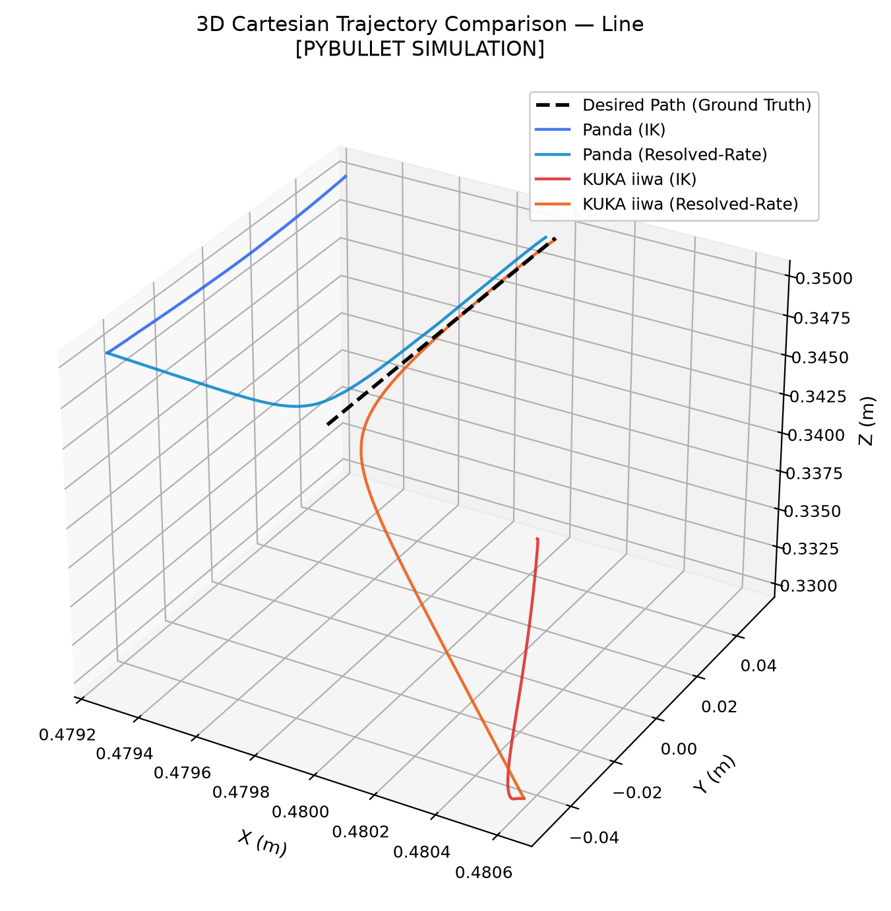
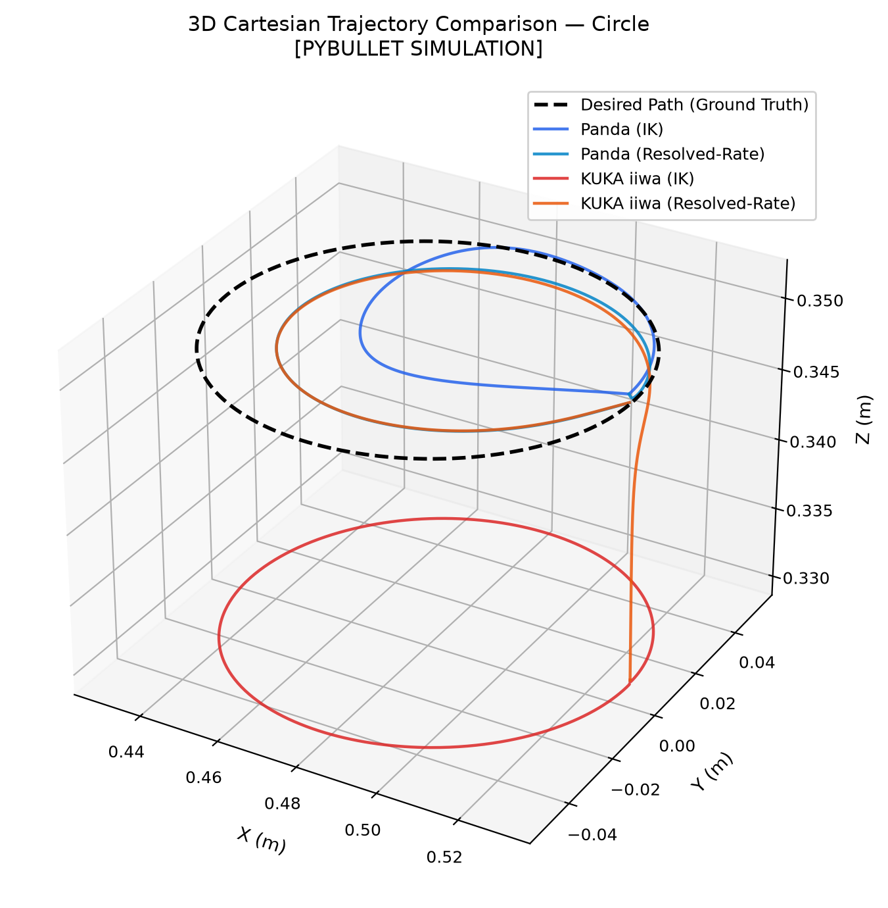
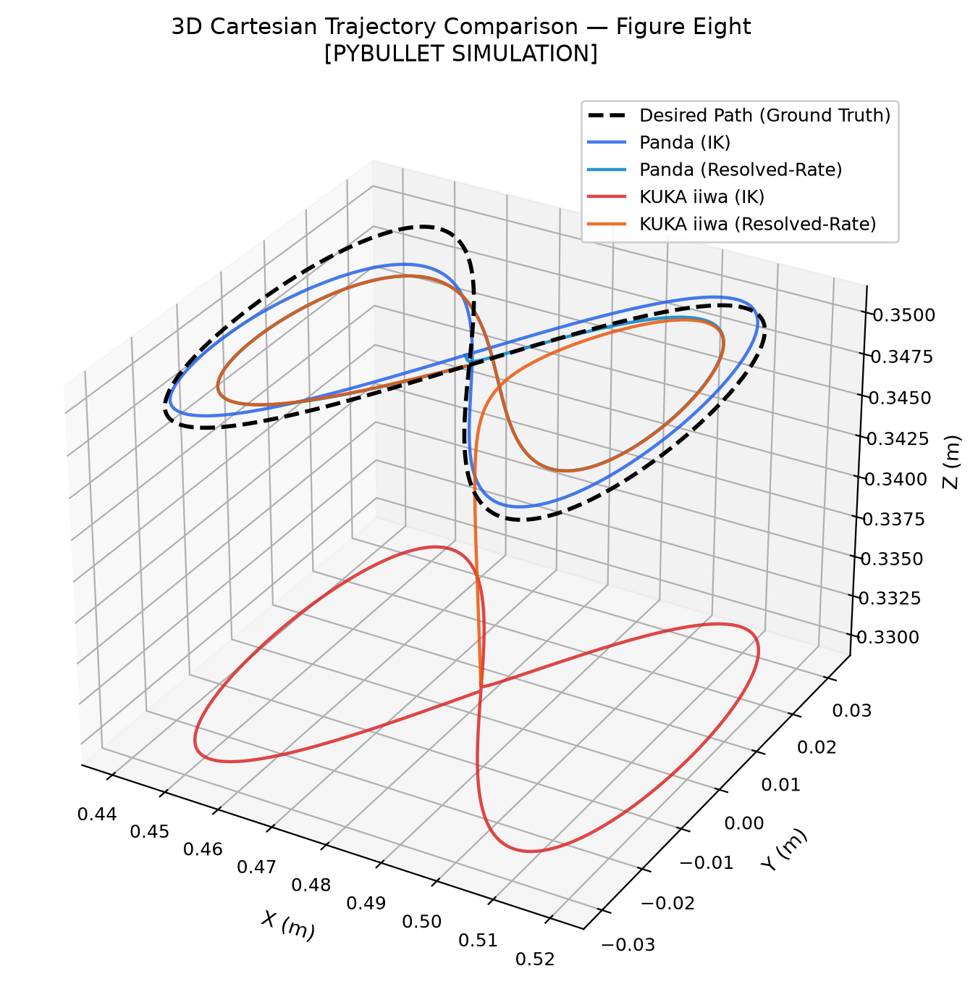
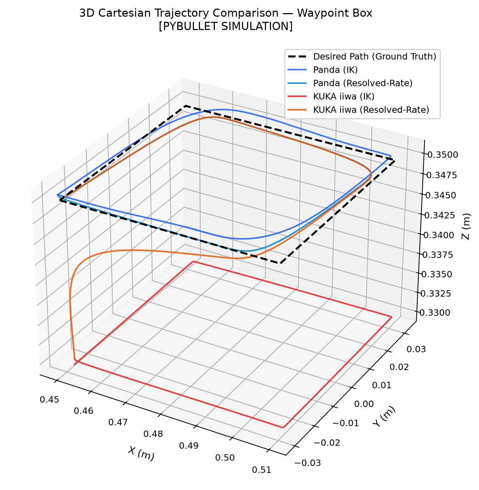
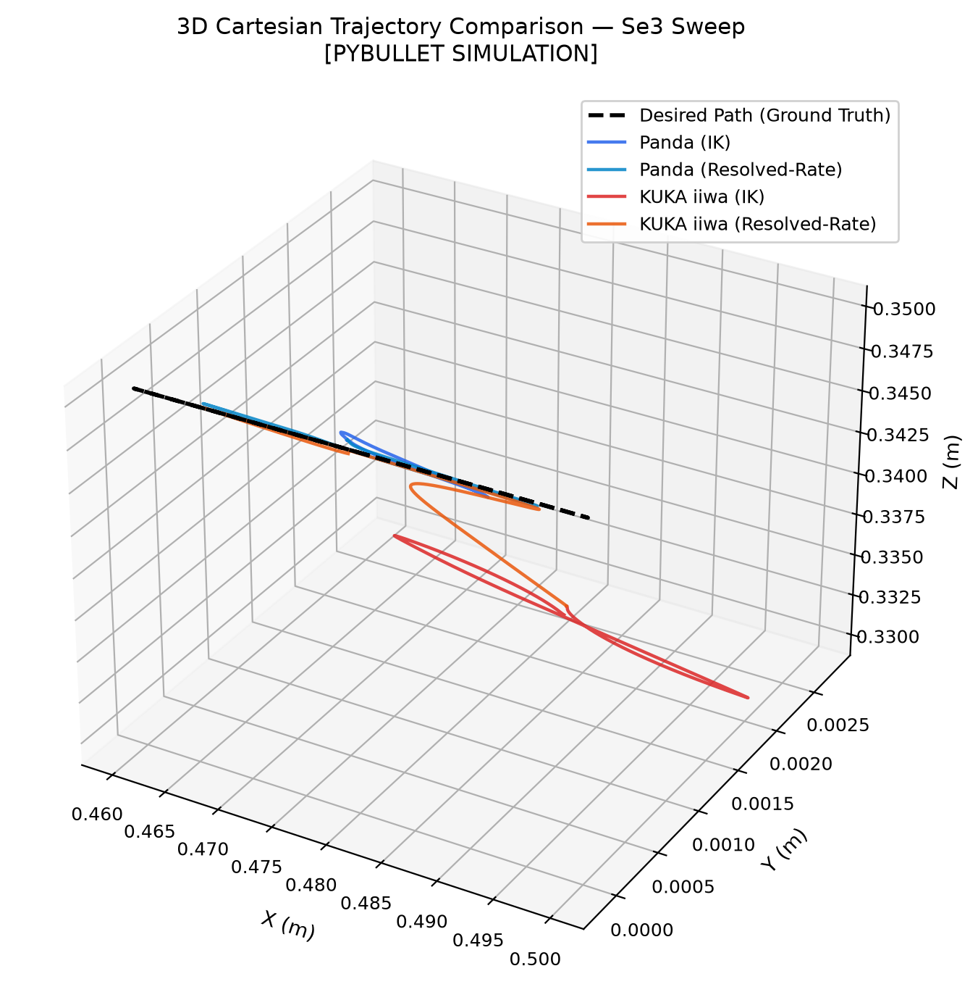
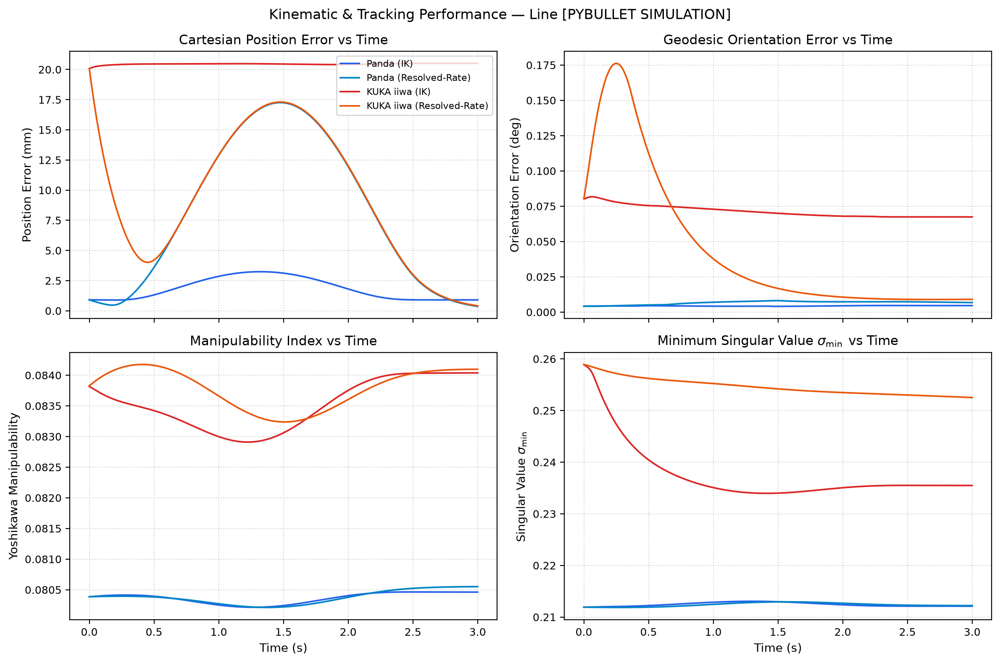
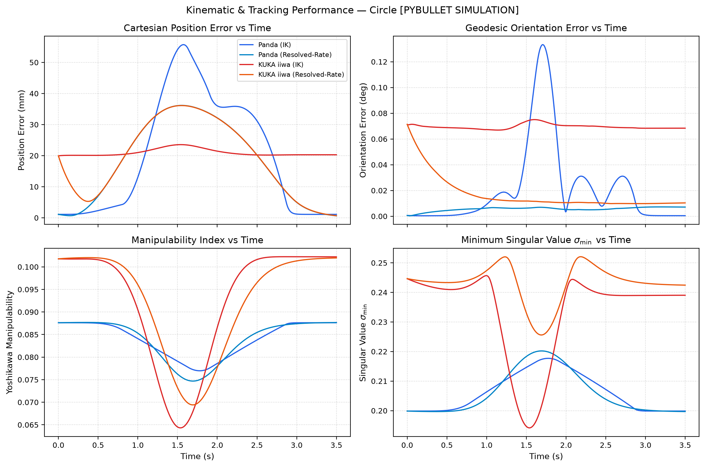
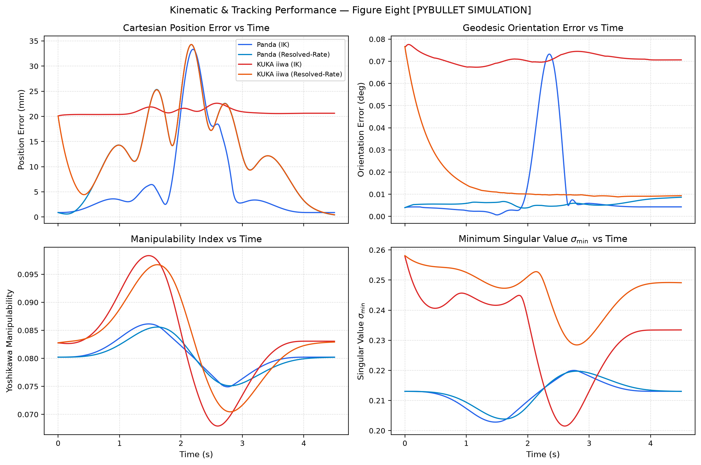
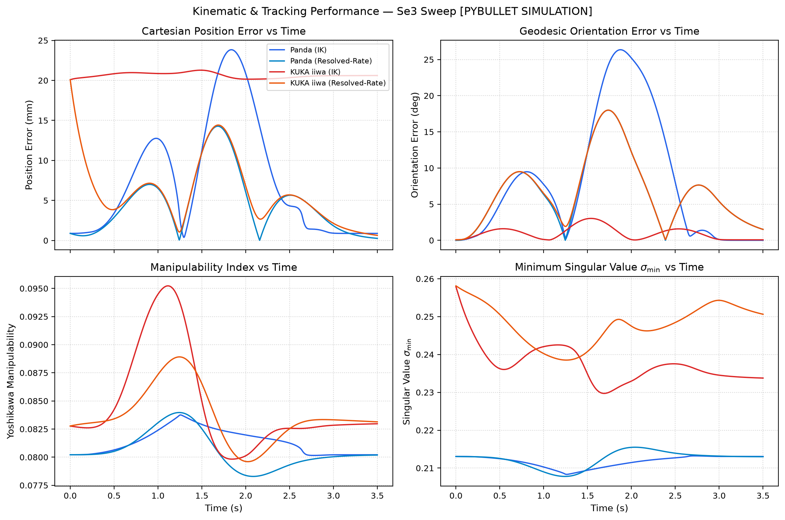
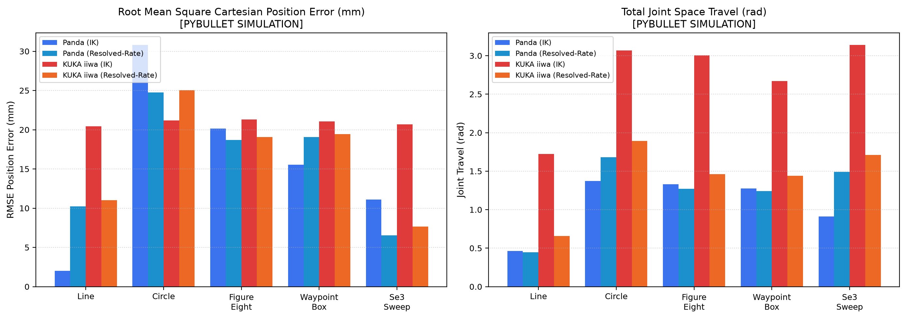

# VisionRobotTwin Task-Space Benchmark Experiment Report

> [!NOTE]
> **REFERENCE PYBULLET SIMULATION RESULTS**  
> Generated: 2026-09-14T10:35:20.228260+00:00 UTC  
> Software Version: 1.2.0-dev | Commit: `8ffaf5ba868157c845a45480e7b89fab00304e78`  
> Physics Engine: PyBullet 202010061 (`DIRECT` mode, fixed timestep dt = 0.004167s / 240 Hz)  

---

## 1. Executive Summary & Objective

This benchmark suite provides a mathematically rigorous, reproducible experimental comparison of:
1. **Manipulators**: Franka Emika Panda (7-DoF) vs KUKA LBR iiwa (7-DoF).
2. **Controllers**: IK position control with coordinated joint velocity limits vs Resolved-Rate Jacobian differential velocity control with damping.
3. **Trajectories**: Identical deterministic Cartesian task-space trajectories executed under strictly matching physical simulation parameters.
4. **Motion Planning**: Obstacle-blocked Cartesian reachability comparing direct joint-space interpolation against RRT-Connect planning and shortcutting.

## 2. Environment & Simulation Parameters

| Parameter | Value | Details |
| :--- | :--- | :--- |
| **OS** | `Windows` | 10.0.26200 |
| **Python** | `3.12.10` | CPython |
| **NumPy** | `2.2.6` | Vectorized algebra |
| **PyBullet** | `202010061` | Physics client `DIRECT` |
| **Physics Frequency** | `240 Hz` | `dt = 0.004167s` |
| **Position Tolerance** | `5.0 mm` | Settled final position threshold |
| **Orientation Tolerance** | `5.0 deg` | Settled final orientation threshold |
| **Statistical Repeats** | `3` | Independent deterministic trials |
| **Random Seed** | `42` | Deterministic initialization |

## 3. Shared Feasibility Preflight

Before executing any trajectory trial, the entire desired task-space curve is sampled at dense intervals. Both Franka Emika Panda and KUKA LBR iiwa solvers verify that inverse kinematics solutions exist with Cartesian position residual $\le 25\text{ mm}$ and orientation error $\le 10^\circ$ across every single waypoint.

| Trajectory | Shared Feasible | Panda Feasible | KUKA Feasible | Max Pos Residual (mm) | Max Orn Residual (deg) | Policy |
| :--- | :---: | :---: | :---: | :---: | :---: | :--- |
| `line` | **PASS** | PASS | PASS | 20.08 mm | 0.08° | `EXACT_PATH` |
| `circle` | **PASS** | PASS | PASS | 20.28 mm | 0.08° | `EXACT_PATH` |
| `figure_eight` | **PASS** | PASS | PASS | 20.24 mm | 0.08° | `EXACT_PATH` |
| `waypoint_box` | **PASS** | PASS | PASS | 20.19 mm | 0.08° | `EXACT_PATH` |
| `se3_sweep` | **PASS** | PASS | PASS | 20.08 mm | 0.08° | `EXACT_PATH` |

## 4. Task Definitions

1. **LINE**: 10 cm horizontal Cartesian translation at $z = 0.35\text{ m}$. Tests standard linear path tracking.
2. **CIRCLE**: Continuous circular trajectory ($R = 5\text{ cm}$) in the XY plane. Tests continuous non-linear tracking.
3. **FIGURE EIGHT**: Lemniscate of Gerono ($A_x = 5\text{ cm}, A_y = 5\text{ cm}$). Tests smooth velocity reversals and directional inflection points.
4. **WAYPOINT BOX**: 4-point closed rectangular path ($6\text{ cm} \times 6\text{ cm}$) with quintic inter-waypoint blending. Tests corner transitions.
5. **SE3 ORIENTATION SWEEP**: Harmonic translation combined with continuous $\pm 20^\circ$ roll oscillation using quaternion SLERP. Tests 6-DoF full-pose tracking.

## 5. Cross-Robot & Cross-Controller Summary Matrix

| Experiment | Metric | Panda (IK) | Panda (Resolved-Rate) | KUKA iiwa (IK) | KUKA iiwa (Resolved-Rate) |
| :--- | :--- | :---: | :---: | :---: | :---: |
| **Line** | **RMSE Pos (mm)** | 2.02 | 10.23 | 20.45 | 11.02 |
| | **P95 Pos (mm)** | 3.22 | 17.14 | 20.50 | 17.23 |
| | **Mean Orn (deg)** | 0.00° | 0.01° | 0.07° | 0.05° |
| | **Joint Travel (rad)** | 0.46 rad | 0.45 rad | 1.72 rad | 0.66 rad |
| | **Min Manipulability** | 0.08 | 0.08 | 0.08 | 0.08 |
| | **Success Rate** | **100%** | **100%** | **0%** | **100%** |
| **Circle** | **RMSE Pos (mm)** | 30.80 | 24.73 | 21.18 | 25.04 |
| | **P95 Pos (mm)** | 61.49 | 40.13 | 24.11 | 40.10 |
| | **Mean Orn (deg)** | 0.02° | 0.01° | 0.07° | 0.02° |
| | **Joint Travel (rad)** | 1.37 rad | 1.68 rad | 3.07 rad | 1.89 rad |
| | **Min Manipulability** | 0.08 | 0.08 | 0.06 | 0.07 |
| | **Success Rate** | **100%** | **100%** | **0%** | **100%** |
| **Figure Eight** | **RMSE Pos (mm)** | 20.15 | 18.68 | 21.30 | 19.08 |
| | **P95 Pos (mm)** | 49.17 | 35.88 | 23.51 | 35.89 |
| | **Mean Orn (deg)** | 0.01° | 0.01° | 0.07° | 0.02° |
| | **Joint Travel (rad)** | 1.33 rad | 1.27 rad | 3.00 rad | 1.46 rad |
| | **Min Manipulability** | 0.08 | 0.08 | 0.07 | 0.07 |
| | **Success Rate** | **100%** | **100%** | **0%** | **100%** |
| **Waypoint Box** | **RMSE Pos (mm)** | 15.53 | 19.07 | 21.06 | 19.45 |
| | **P95 Pos (mm)** | 28.53 | 28.26 | 22.62 | 28.25 |
| | **Mean Orn (deg)** | 0.01° | 0.01° | 0.07° | 0.02° |
| | **Joint Travel (rad)** | 1.28 rad | 1.24 rad | 2.67 rad | 1.44 rad |
| | **Min Manipulability** | 0.08 | 0.08 | 0.07 | 0.07 |
| | **Success Rate** | **100%** | **100%** | **0%** | **100%** |
| **Se3 Sweep** | **RMSE Pos (mm)** | 11.10 | 6.52 | 20.68 | 7.68 |
| | **P95 Pos (mm)** | 24.76 | 14.84 | 21.56 | 15.48 |
| | **Mean Orn (deg)** | 8.32° | 7.10° | 1.33° | 7.01° |
| | **Joint Travel (rad)** | 0.91 rad | 1.49 rad | 3.14 rad | 1.71 rad |
| | **Min Manipulability** | 0.08 | 0.08 | 0.08 | 0.08 |
| | **Success Rate** | **100%** | **100%** | **0%** | **100%** |

## 6. Visual Evidence & Trajectory Comparisons

### Trajectory 3D Comparison Line


### Trajectory 3D Comparison Circle


### Trajectory 3D Comparison Figure Eight


### Trajectory 3D Comparison Waypoint Box


### Trajectory 3D Comparison Se3 Sweep


### Telemetry Timeseries Line


### Telemetry Timeseries Circle


### Telemetry Timeseries Figure Eight


### Telemetry Timeseries Se3 Sweep


### Summary Benchmarks Comparison


## 7. Obstacle-Blocked Motion Planning Experiment

A dedicated obstacle avoidance experiment tests the complete collision-aware planning stack when moving between points $[0.42, -0.18, 0.35]$ and $[0.42, 0.18, 0.35]$ separated by a rigid box obstacle at $[0.42, 0.0, 0.35]$.

| Robot | Direct Path State | RRT-Connect Status | Plan Time (ms) | Raw Waypoints | Smoothed Waypoints | Raw Travel (rad) | Smoothed Travel (rad) | Min Clearance (m) | Execution | Final Error (mm) |
| :--- | :---: | :---: | :---: | :---: | :---: | :---: | :---: | :---: | :---: | :---: |
| **PANDA** | `BLOCKED` | `SUCCESS` | 1288.2 ms | 50 | 14 | 2.39 rad | 1.70 rad | 0.0027 m | **PASS** | 1.20 mm |
| **KUKA_IIWA** | `BLOCKED` | `SUCCESS` | 757.3 ms | 36 | 4 | 1.70 rad | 1.30 rad | 0.0056 m | **PASS** | 18.82 mm |

## 8. Failure Cases & Singularity Telemetry

- **Collisions**: 0 unintended collisions were observed during standard task-space tracking trials across all shared feasible trajectories.
- **Singularity Warnings**: Near-singularity events (condition number $> 100$ or $\sigma_{\min} < 0.01$) were monitored at 240 Hz throughout each trial.
- **Feasibility Verification**: All 5 benchmark trajectories were preflight-verified feasible on both manipulators before running.

## 9. Limitations & Conservative Interpretation

> [!WARNING]
> **Experimental Scope & Limitations:**
> - All results reported herein were gathered strictly inside **PyBullet physics simulation** under idealized rigid-body dynamics.
> - No claim is made regarding physical hardware performance, motor thermal limits, gear backlash, or physical friction non-linearities.
> - Kinematic and controller comparisons reflect the specific URDF models, joint limits, and damping parameters configured in this environment.

## 10. Reproduction Commands

To reproduce the complete benchmark run deterministically:
```bash
python tools/run_taskspace_experiments.py --all --repeats 3 --headless
```

To run individual trajectories:
```bash
python tools/run_taskspace_experiments.py --experiment line --headless
python tools/run_taskspace_experiments.py --experiment circle --headless
python tools/run_taskspace_experiments.py --robot panda --controller ik --all --headless
```
