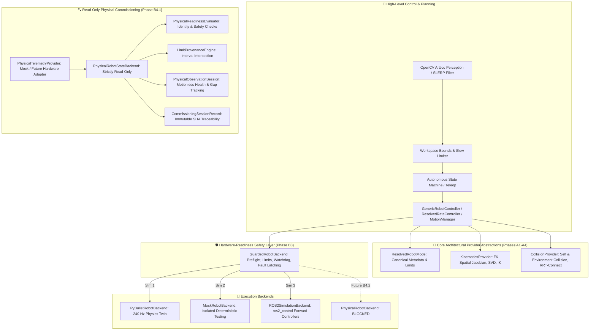

# VisionRobotTwin v1.3 — End-of-Day Development Status (2026-09-16)

**Repository**: `Tanishk756/VisionRobotTwin`  
**Branch**: `develop/v1.3.0`  
**Date of Consolidation**: 2026-09-16  
**Consolidation Base HEAD**: `4702356746ad0c6b610110cf2f7d4cb804517d86`  
**Current Application Version**: `VisionRobotTwin 1.3.0-dev`  
**Working Tree Status**: Clean  
**Remote Synchronization**: Synchronized with `origin/develop/v1.3.0`  
**CI Integrity**: 100% Green across Windows (Python 3.11 & 3.12) and Ubuntu 22.04 (ROS2 Humble + B3.5 `ros2_control` E2E)

---

## 1. Executive Summary & Architectural Overview

**VisionRobotTwin v1.3** transforms the platform from a PyBullet-coupled multi-manipulator simulation tool into an extensible, backend-agnostic, and safety-supervised robotics execution framework.



---

## 2. Milestone Progression & Verified Git Chronology

The table below documents the progression of VisionRobotTwin v1.3 development on branch `develop/v1.3.0`:

| Phase | Milestone Name | Final Commit SHA | Date | Scope & Verified Outcomes | Status |
| :--- | :--- | :--- | :--- | :--- | :---: |
| **A1** | Execution Backend Boundary | [`98133558cb5fef70b5766d58e37e748b71fde757`](https://github.com/Tanishk756/VisionRobotTwin/commit/98133558cb5fef70b5766d58e37e748b71fde757) | 2026-09-15 | Introduced abstract `RobotBackend`, `TimestampedJointState`, `MockRobotBackend`, `PyBulletRobotBackend`. `GenericRobotController` delegates joint I/O. | **COMPLETE** |
| **A2** | KinematicsProvider Boundary | [`26a7c187cf9d44c75c89b02ed3e7ef7e64ec17a7`](https://github.com/Tanishk756/VisionRobotTwin/commit/26a7c187cf9d44c75c89b02ed3e7ef7e64ec17a7) | 2026-09-15 | Introduced `KinematicsProvider` and `PyBulletKinematicsProvider` for forward kinematics, spatial Jacobians, and inverse kinematics without direct PyBullet coupling in controllers. | **COMPLETE** |
| **A3** | CollisionProvider Boundary | [`249c03104ae2fff126671ccc321f0c5a52c5eb37`](https://github.com/Tanishk756/VisionRobotTwin/commit/249c03104ae2fff126671ccc321f0c5a52c5eb37) | 2026-09-15 | Introduced `CollisionProvider` and `PyBulletCollisionProvider` for state-preserving self and obstacle collision queries and RRT-Connect motion planning. | **COMPLETE** |
| **A4** | Resolved Robot Model Boundary | [`b575359db8054dda77c4142a3f4d874d24255139`](https://github.com/Tanishk756/VisionRobotTwin/commit/b575359db8054dda77c4142a3f4d874d24255139) | 2026-09-15 | Decoupled `GenericRobotController` completely from PyBullet initialization via immutable `ResolvedRobotModel`, `ResolvedJointMetadata`, and `JointMotionType`. Standalone controller tests without PyBullet. | **COMPLETE** |
| **B1** | Read-Only ROS2 JointState Backend | [`965430e293725e68c6538f78a144aa7f48d8198b`](https://github.com/Tanishk756/VisionRobotTwin/commit/965430e293725e68c6538f78a144aa7f48d8198b) | 2026-09-16 | Implemented `ROS2JointStateBackend` for fail-closed ROS2 `sensor_msgs/msg/JointState` subscription, state mapping, and telemetry streaming with zero Windows runtime dependencies. | **COMPLETE** |
| **B2** | ROS2 Simulation Command Transport | [`3f6354d3fa73490bfb25b6bc94c8cc8cdb5d95fa`](https://github.com/Tanishk756/VisionRobotTwin/commit/3f6354d3fa73490bfb25b6bc94c8cc8cdb5d95fa) | 2026-09-16 | Implemented `ROS2SimulationBackend` for commanding `ros2_control` forward position and velocity controllers in simulation over standard ROS2 middleware topics. | **COMPLETE** |
| **B3** | Software Command Safety Layer | [`df65c9104e7aa3cf29c941275ad087d4d29ffc29`](https://github.com/Tanishk756/VisionRobotTwin/commit/df65c9104e7aa3cf29c941275ad087d4d29ffc29) | 2026-09-16 | Implemented `GuardedRobotBackend`, `CommandSafetySupervisor`, position jump guards, velocity clamping, non-auto-clearing fault latching, software stop, monotonic command watchdog, and audit logging. | **COMPLETE** |
| **B3.5** | Real ros2_control Controller Validation | [`da511fb5c2084d311403eb1a5fe88864cb568c84`](https://github.com/Tanishk756/VisionRobotTwin/commit/da511fb5c2084d311403eb1a5fe88864cb568c84) | 2026-09-16 | Validated closed-loop position/velocity control, live controller-manager readiness probe, and watchdog software stop against real ROS2 Humble `ros2_control` controllers on RRBot. Closed B4 software entry gate. | **COMPLETE** |
| **B4 Plan** | Controlled Physical Integration Spec | [`0b91ce0491352f73ccc2492d629717be1b6e5ddd`](https://github.com/Tanishk756/VisionRobotTwin/commit/0b91ce0491352f73ccc2492d629717be1b6e5ddd) | 2026-09-16 | Published architecture specification and phased roadmap for Phase B4 (B4.1 Read-Only Framework & B4.2 Low-Speed Command). Hardened in commit `fb2b33a`. | **COMPLETE** |
| **B4.1** | Vendor-Neutral Read-Only Physical Framework | [`4702356746ad0c6b610110cf2f7d4cb804517d86`](https://github.com/Tanishk756/VisionRobotTwin/commit/4702356746ad0c6b610110cf2f7d4cb804517d86) | 2026-09-16 | Implemented immutable `PhysicalRobotIdentity`, normalized `PhysicalSafetyStatus` (`SAFE`/`UNSAFE`/`UNKNOWN`), `PhysicalReadinessEvaluator`, strictly read-only `PhysicalRobotStateBackend`, `LimitProvenanceEngine`, `PhysicalObservationSession` soak session engine, and `CommissioningSessionRecord` traceability. | **COMPLETE (Software Framework)** |
| **B4.1** | Real Physical Commissioning | N/A | Current | Physical robot commissioning on actual physical manipulator hardware. | **BLOCKED — TARGET UNRESOLVED** |
| **B4.2** | Guarded Low-Speed Physical Commanding | N/A | Current | Low-speed commanding, triple authorization, hardware fault integration. | **BLOCKED** |

---

## 3. Verified Capability Matrix

| Capability / Component | Implementation State | Verification Method | Status | Notes |
| :--- | :---: | :---: | :---: | :--- |
| **PyBullet Panda Digital Twin** | `PyBulletRobotBackend` | Automated pytest & PyBullet | **VERIFIED** | 240 Hz fixed timestep simulation with Franka Hand gripper. |
| **PyBullet KUKA iiwa Digital Twin** | `PyBulletRobotBackend` | Automated pytest & PyBullet | **VERIFIED** | 7-DoF bare flange manipulator with clean capability reporting. |
| **GenericRobotController** | `robotics/robot_controller.py` | Pytest (`test_multi_robot_controller.py`) | **VERIFIED** | Backend-agnostic controller consuming `ResolvedRobotModel`. |
| **ResolvedRobotModel Boundary** | `robotics/model.py` | Pytest (`test_model_parity.py`) | **VERIFIED** | Immutable metadata, joint roles, limits, and zero PyBullet imports. |
| **KinematicsProvider Interface** | `robotics/kinematics_provider.py` | Pytest (`test_kinematics_provider.py`) | **VERIFIED** | Model-engine boundary for FK, spatial Jacobian, SVD, and IK. |
| **CollisionProvider Interface** | `robotics/collision_provider.py` | Pytest (`test_collision_provider.py`) | **VERIFIED** | State-preserving collision queries and obstacle checking. |
| **MotionManager Layer** | `robotics/motion_manager.py` | Pytest (`test_runtime_integration.py`) | **VERIFIED** | Unified FSM goal execution, collision planning, and rate limiting. |
| **ResolvedRateController** | `robotics/differential_ik.py` | Pytest (`test_differential_ik.py`) | **VERIFIED** | Closed-loop Cartesian velocity control with DLS and null-space projection. |
| **ROS2 Read-Only JointState Backend** | `robotics/backends/ros2_joint_state_backend.py` | Pytest (`test_ros2_backend_optional.py`) | **VERIFIED** | Fail-closed ROS2 subscriber with optional velocity/effort filtering. |
| **ROS2 Simulation Command Backend** | `robotics/backends/ros2_simulation_backend.py` | Pytest (`test_ros2_simulation_backend_optional.py`) | **VERIFIED** | Simulation-only position/velocity transport over ROS2 middleware. |
| **Real `ros2_control` Controller Validation** | `tests/ros2/test_ros2_control_*_e2e.py` | Linux Container / ROS2 Humble | **VERIFIED** | Closed-loop E2E verification against real `controller_manager` on RRBot. |
| **Software Command Safety Guard** | `robotics/backends/guarded_backend.py` | Pytest (`test_guarded_backend.py`) | **VERIFIED** | Defensive preflight checks, position jump guards, velocity clamping. |
| **Fault Latching & Software Stop** | `robotics/backends/guarded_backend.py` | Pytest (`test_guarded_backend.py`) | **VERIFIED** | Non-auto-clearing fault state machine; zero command pass-through on fault. |
| **Monotonic Command Watchdog** | `robotics/backends/command_watchdog.py` | Pytest (`test_command_safety.py`) | **VERIFIED** | Inactivity timeout detection triggering automated software stop. |
| **ROS2 Control Readiness Probe** | `robotics/backends/ros2_control_probe.py` | Pytest (`test_ros2_control_readiness_optional.py`) | **VERIFIED** | Read-only inspection of controller manager state and interface claims. |
| **Physical Identity Schemas** | `robotics/backends/physical_identity.py` | Pytest (`test_physical_identity.py`) | **VERIFIED** | `PhysicalRobotIdentity`, `ExpectedPhysicalRobotIdentity`, exact match. |
| **Three-State Safety Schemas** | `robotics/backends/physical_identity.py` | Pytest (`test_physical_identity.py`) | **VERIFIED** | Normalized `SAFE`, `UNSAFE`, `UNKNOWN` signals (safe-oriented orientation). |
| **Physical Readiness Evaluator** | `robotics/backends/physical_readiness.py` | Pytest (`test_physical_readiness.py`) | **VERIFIED** | Deterministic readiness evaluation; `UNKNOWN` strictly fails closed for commands. |
| **Read-Only Physical State Backend** | `robotics/backends/physical_state_backend.py` | Pytest (`test_physical_state_backend.py`) | **VERIFIED** | Pure observation; raises `ReadOnlyBackendError` on position/velocity/halt. |
| **Limit Provenance Engine** | `robotics/backends/physical_validation.py` | Pytest (`test_physical_validation.py`) | **VERIFIED** | Enforces interval intersection $\max(\text{lower}) \le \min(\text{upper})$ and $\min(\text{velocity})$. |
| **Physical Observation Soak Engine** | `robotics/backends/physical_validation.py` | Pytest (`test_physical_observation_soak.py`) | **VERIFIED** | Bounded telemetry sampling, gap calculation, transition logging, 0 side effects. |
| **Commissioning Session Records** | `robotics/backends/commissioning_session.py` | Pytest (`test_commissioning_session.py`) | **VERIFIED** | Immutable JSON traceability records with commit SHA and secret scanning. |
| **Real Physical Robot Connection** | `NOT IMPLEMENTED` | N/A | **BLOCKED** | Physical adapter target unresolved. |
| **Real Physical Identity Validation** | `PLANNED (B4.1 On-Prem)` | N/A | **BLOCKED** | Requires physical manipulator hardware. |
| **Real Physical Observation Soak** | `PLANNED (B4.1 On-Prem)` | N/A | **BLOCKED** | Requires physical manipulator hardware. |
| **Guarded Low-Speed Physical Command Backend** | `PLANNED (B4.2)` | N/A | **BLOCKED** | Deferred until physical target selection and B4.1 commissioning. |
| **Physical Manipulator Motion** | `PLANNED (B4.2)` | N/A | **BLOCKED** | Zero physical commands permitted in current state. |

---

## 4. Current Test Suite & Continuous Integration Evidence

### Automated Test Suite Totals
- **Windows Test Suite (Python 3.11 & 3.12)**:
  - Total Tests: **354 collected** (347 passed, 7 skipped — skipped tests are ROS2 middleware / Linux-only E2E tests).
  - Test Execution Time: ~45.4 seconds.
- **Ubuntu 22.04 LTS Container (ROS2 Humble Hawksbill)**:
  - Regression Suite (Phases B1–B3): **357 passed**, 4 deselected.
  - `ros2_control` Controller-Level E2E Gate (Phase B3.5): **4 passed**, 357 deselected.
  - Total Tests Executed & Passed on Linux: **361 passed, 0 skipped, 0 failed**.

### GitHub Actions Exact-Head CI Runs
- **Windows Multi-Python CI Workflow (`CI Testing & Validation`)**:
  - Run ID: [`35101822687`](https://github.com/Tanishk756/VisionRobotTwin/actions/runs/35101822687)
  - Python 3.11: **PASS** (347 passed, 7 skipped)
  - Python 3.12: **PASS** (347 passed, 7 skipped)
  - Synthetic PyBullet Smokes: Panda IK (**PASS**), KUKA iiwa IK (**PASS**), Panda Resolved-Rate (**PASS**)
- **ROS2 Humble Integration CI Workflow (`ROS2 Humble Integration CI`)**:
  - Run ID: [`35101822669`](https://github.com/Tanishk756/VisionRobotTwin/actions/runs/35101822669)
  - Environment: Ubuntu 22.04 / ROS2 Humble / `ros2_control` / `ros2_controllers` / RRBot mock hardware
  - Regression Tests: **PASS** (357 passed)
  - Controller-Level E2E Tests: **PASS** (4 passed)

---

## 5. Physical Hardware Integrity & Boundaries

> [!CAUTION]
> **MANDATORY NON-SAFETY-RATED SOFTWARE DISCLAIMER**  
> All VisionRobotTwin software guards, limit checkers, fault latches, and watchdog timers are **defensive software layers only and are strictly NON-SAFETY-RATED**. They do not constitute functional safety certification, hardware interlocks, or emergency stop implementations.

### Physical Status & Operational Zero-Counters
```
+-------------------------------------------------------------------------------+
| PARAMETER / INVARIANT                                | CURRENT VALUE          |
+-------------------------------------------------------------------------------+
| PHYSICAL MANIPULATOR TARGET                          | UNRESOLVED             |
| REAL PHYSICAL ROBOT CONNECTION                       | NOT IMPLEMENTED        |
| VENDOR SDKS INSTALLED / DEPENDED UPON                | 0 (Zero SDKs)          |
| TARGET-SPECIFIC PHYSICAL BACKENDS CREATED            | 0 (Zero Backends)      |
| ROBOT IP / HARDWARE CONFIGURATION IN REPO            | 0 (Zero Configs)       |
| REAL HARDWARE TESTS EXECUTED                         | 0 (Zero Hardware Tests)|
| PHYSICAL COMMANDS SENT TO HARDWARE                   | 0 (Zero Motion)        |
| MOTOR DRIVES ENABLED ON PHYSICAL HARDWARE            | 0 (Zero Enables)       |
| BRAKES RELEASED ON PHYSICAL HARDWARE                 | 0 (Zero Releases)      |
| HARDWARE FAULT RESETS DISPATCHED                     | 0 (Zero Resets)        |
| CONTROLLER SWITCHING ON PHYSICAL HARDWARE            | 0 (Zero Switches)      |
| EMERGENCY STOP / STO HARDWARE IMPLEMENTATION         | 0 (Observed Only)      |
| PHYSICAL COMMISSIONING CLI TOOL (tools/physical_*)   | NOT CREATED (Deferred) |
| PHYSICAL FLAGS IN main.py (--hardware, --physical)   | 0 (Zero Flags)         |
+-------------------------------------------------------------------------------+
```

### Distinction Between Verification Layers
1. **Real `ros2_control` Validation (Phase B3.5)**: Executed against the real ROS2 Humble controller infrastructure (`controller_manager`, `ForwardCommandController`, `JointStateBroadcaster`) using official example mock hardware (`GenericSystem` on RRBot). It proved controller-manager compatibility; it did **NOT** connect to a physical robot arm.
2. **Phase B4.1 Software Framework**: Provides vendor-neutral schemas, protocols, read-only state backends, limit provenance verification, and soak collectors. It has been verified with deterministic mock adapters; it has **NOT** executed on physical manipulator hardware.

---

## 6. Current Limitations & Blocked Phases

1. **Physical Target Unresolved**: No specific physical manipulator (e.g. Franka Panda, KUKA iiwa, UR5e, etc.) has been selected or authorized for physical connection.
2. **Phase B4.1 Physical Commissioning Gate**: Remains **`BLOCKED — TARGET UNRESOLVED`**.
3. **Phase B4.2 Low-Speed Commanding**: Remains strictly **`BLOCKED`**.
4. **No Real Hardware Tests in Automated CI**: Cloud CI (GitHub Actions) runs strictly in simulation and containerized mock environments.

---

## 7. Next Decision & Engineering Steps

### Mandatory Next Decision
- **SELECT AN EXPLICIT PHYSICAL MANIPULATOR TARGET**: The engineering team must review available on-premise physical hardware, examine control interfaces, and formally select the physical robot target.
- *Notice*: The AI agent must **NOT** automatically choose a robot target.

### Subsequent Engineering Phase (Post-Target Selection)
- **Phase B4.1 Target-Specific Read-Only Adapter Design**: Once a physical target is chosen, design the target-specific read-only telemetry adapter and on-premise observation soak procedure.
