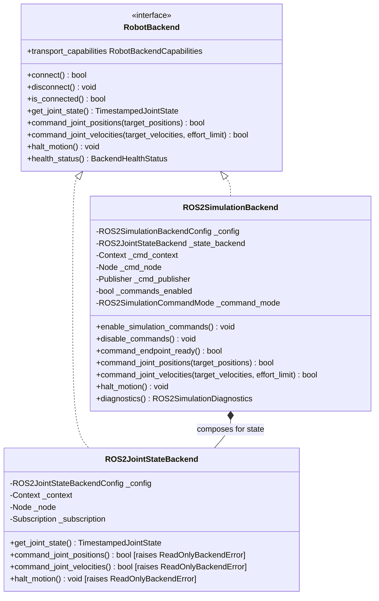
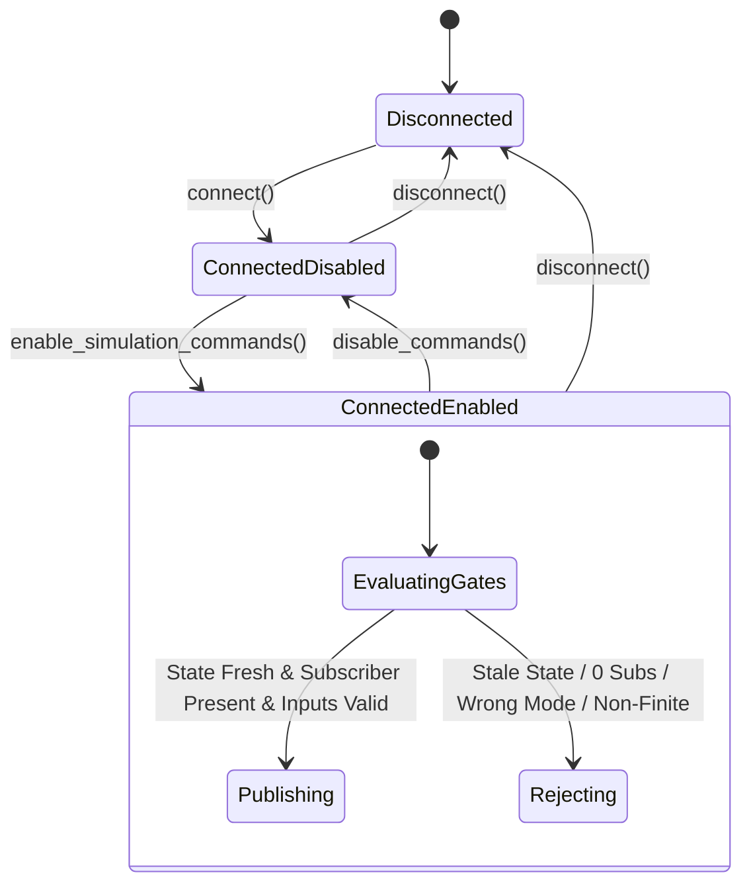

# VisionRobotTwin Phase B2 Design Specification: ROS2 Simulation Command Transport

**Document ID:** `SPEC-2026-09-16-V1.3-PHASE-B2-ROS2-SIMULATION-COMMAND`  
**Status:** Hardened Binding Specification  
**Target Milestone:** VisionRobotTwin v1.3.0 Phase B2  
**Target Environments:** Ubuntu 22.04 LTS (ROS2 Humble Hawksbill, Python 3.10), Windows 11 (Non-ROS PyBullet regression baseline)  
**Parent Phase:** Phase B1 (Read-Only ROS2 JointState Backend)  
**Subsequent Phase:** Phase B3 (Physical Hardware Integration & Watchdog Enforcement)

---

## 1. Executive Summary & Objective

Phase B2 introduces an **optional, simulation-only ROS2 command transport** (`ROS2SimulationBackend`) to VisionRobotTwin. This backend enables `GenericRobotController`, `MotionManager`, and `ResolvedRateController` to command simulated robot manipulators managed by `ros2_control` forward controllers (`JointGroupPositionController` and `JointGroupVelocityController`) over standard ROS2 middleware topics.

### Critical Safety Mandates:
1. **Simulation Policy Declaration:** `environment="simulation"` is a **software policy interlock only**. The software cannot independently prove that a configured ROS command endpoint is not connected to physical hardware. Physical robot hardware commanding is strictly out of scope for Phase B2.
2. **Immutable Read-Only B1 Backend:** `ROS2JointStateBackend` remains permanently read-only and unmodified, continuing to raise `ReadOnlyBackendError` on all command calls.
3. **Fail-Closed Command Authorization:** All command capabilities start disabled by default (`commands_enabled=False`) and require explicit post-connection invocation of `enable_simulation_commands()`.
4. **Telemetry Freshness Gating:** Ordinary position and nonzero velocity command dispatches require a fresh, valid joint state within `state_timeout_s`.
5. **Mode-Specific Halt Behavior:** Velocity-mode halt (`[0.0] * dof`) executes even if telemetry is stale or temporarily unavailable. Position-mode halt requires fresh telemetry to publish measured `q_current` as hold setpoint.
6. **No CLI Exposure:** `main.py` CLI is not modified to expose ROS2 command flags. B2 is exercised exclusively through test suites and simulation diagnostic tooling.

---

## 2. Command Architecture Comparison & Recommendation

We evaluated three command transport paradigms for ROS2 integration:

| Criterion | Approach A: Forward Controller Streaming | Approach B: FollowJointTrajectory Action | Approach C: Hybrid Streaming + Action (Recommended) |
|---|---|---|---|
| **Message Type** | `std_msgs/msg/Float64MultiArray` | `control_msgs/action/FollowJointTrajectory` | `Float64MultiArray` (Phase B2) + `FollowJointTrajectory` (Future) |
| **Topic / Action Endpoint** | `/<controller>/commands` | `/<controller>/follow_joint_trajectory` | `/<controller>/commands` for streaming |
| **Rate Suitability** | High (50–250 Hz setpoints) | Low to Medium (trajectory batches) | High for direct setpoints |
| **API Semantic Fit** | Exact match for `command_joint_positions` & `command_joint_velocities` | Mismatch for 1-point high-frequency setpoints | Exact fit for existing `RobotBackend` APIs |
| **Resolved-Rate Mapping** | Natural vector velocity streaming | Poor (preempts previous 1-point goal) | Direct velocity streaming |
| **MotionManager Mapping** | Steps sampled trajectory setpoints | Controller-managed interpolation | Steps sampled trajectory in B2 |

### Architectural Decision:
**Phase B2 implements Approach C (Streaming Transport First).**  
- Position setpoints are streamed to `position_controllers/JointGroupPositionController` via `std_msgs/msg/Float64MultiArray`.
- Velocity setpoints are streamed to `velocity_controllers/JointGroupVelocityController` via `std_msgs/msg/Float64MultiArray`.
- `control_msgs/action/FollowJointTrajectory` is formally documented as the future trajectory delegation transport when `MotionManager` delegates complete splines rather than stepping local quintic samples, but is omitted from B2 to prevent 1-point action goal preemption anti-patterns.

---

## 3. Backend Composition & Lifecycle Architecture

`ROS2SimulationBackend` implements `RobotBackend` by composing `ROS2JointStateBackend` for telemetry ingestion while managing its own isolated command context, node, and publisher.



### Key Composition Rules:
1. **Isolated Contexts / Clean Ownership:** `ROS2SimulationBackend` manages its command node in an isolated private `rclpy.context.Context`, constructing a fresh context per `connect()` lifecycle and cleanly destroying it upon `disconnect()`.
2. **Telemetry Delegation:** State acquisition and freshness checks are delegated to the internal `ROS2JointStateBackend`.
3. **No Private Leakage:** Zero access to `ROS2JointStateBackend._node`, `_context`, or other private internals. State is queried via public `get_joint_state()` and `health_status()`.
4. **Domain ID Synchronization:** If `domain_id` is supplied in configuration, both state and command contexts use the identical domain ID.

---

## 4. Configuration Schema & Command Modes

### 4.1 Command Mode Specialization
To guarantee that conflicting position and velocity commands are never published simultaneously to shared hardware interfaces, each `ROS2SimulationBackend` instance is configured with exactly **one** immutable command mode:

```python
class ROS2SimulationCommandMode(Enum):
    POSITION = auto()
    VELOCITY = auto()
```

- **Position-Mode Backend:** Publishes to `position_command_topic`. Dispatches `command_joint_positions()`. Rejects `command_joint_velocities()` with `UnsupportedBackendOperationError`.
- **Velocity-Mode Backend:** Publishes to `velocity_command_topic`. Dispatches `command_joint_velocities()`. Rejects `command_joint_positions()` with `UnsupportedBackendOperationError`.

### 4.2 Configuration Schema
```python
@dataclass(frozen=True)
class ROS2SimulationBackendConfig:
    state_config: ROS2JointStateBackendConfig
    command_mode: str = "position"  # "position" or "velocity"
    position_command_topic: Optional[str] = "/forward_position_controller/commands"
    velocity_command_topic: Optional[str] = "/forward_velocity_controller/commands"
    commands_enabled: bool = False
    require_subscriber_ready: bool = True
    command_qos: str = "system_default"  # "system_default", "reliable", "best_effort"
    environment: str = "simulation"  # Must strictly be "simulation"
    command_node_name: str = "visionrobottwin_sim_command"
    command_node_namespace: str = ""
```

### Validation Constraints:
- `state_config`: Valid `ROS2JointStateBackendConfig` instance.
- `command_mode`: Must be `"position"` or `"velocity"`.
- `environment`: Must be `"simulation"`. Any other string (e.g. `"hardware"`) raises `ValueError`.
- `position_command_topic`: Required and non-empty when `command_mode == "position"`.
- `velocity_command_topic`: Required and non-empty when `command_mode == "velocity"`.
- `command_qos`: Must be one of `"system_default"`, `"reliable"`, or `"best_effort"`.

---

## 5. Command Authorization & Gating Lifecycle



### 5.1 Enablement Rules (`enable_simulation_commands`)
Command publication is permitted only when all of the following conditions are met:
1. `backend.is_connected() == True`.
2. `environment == "simulation"`.
3. Composed `ROS2JointStateBackend.get_joint_state()` returns fresh telemetry within `state_timeout_s`.
4. If `require_subscriber_ready == True`, `command_publisher.get_subscription_count() >= 1`.

If zero subscribers are present when readiness is required, `enable_simulation_commands()` raises `BackendCommandUnavailableError`.

### 5.2 Disablement Rules (`disable_commands`)
- Immediately sets `commands_enabled = False`.
- Rejects all subsequent command attempts with `BackendCommandDisabledError`.
- Does not automatically publish a stop; caller is expected to invoke `halt_motion()` before disabling if active stopping is required.

---

## 6. Command Dispatch & Halt Semantics

### 6.1 Position Command Transport
```python
def command_joint_positions(self, target_positions: Sequence[float]) -> bool:
    # 1. Check backend connected
    # 2. Check command mode == POSITION
    # 3. Check commands enabled
    # 4. Check endpoint subscriber readiness if required
    # 5. Check state freshness via _state_backend.get_joint_state()
    # 6. Check DoF matches len(expected_joint_names)
    # 7. Check all values math.isfinite
    # 8. Construct std_msgs/msg/Float64MultiArray and publish
```
- **Return Value:** Returns `True` indicating local publication acceptance. It does **not** signify remote goal completion or trajectory convergence.

### 6.2 Velocity Command Transport & `effort_limit` Handling
`std_msgs/msg/Float64MultiArray` has no field for torque or effort limits.
- If `command_joint_velocities(qdot, effort_limit=...)` is called with `effort_limit is not None`, the backend **fails closed** and raises `UnsupportedBackendOperationError`.

### 6.3 Halt Semantics (`halt_motion`)
`halt_motion()` performs an **application software motion stop**:
- **Velocity Mode:** Publishes an all-zero vector `[0.0] * dof` to the velocity command topic. It does **not** require measured position telemetry; freshness failure does not block zero-velocity stop.
- **Position Mode:** Queries the current fresh measured positions `q_current` from `_state_backend.get_joint_state()` and publishes `q_current` as a hold setpoint to the position command topic. Stale state raises `BackendStateStaleError`.

---

## 7. Exception Hierarchy & Transport Capabilities

### 7.1 Backend Exceptions (`robotics/backends/base.py`)
```python
class BackendError(RuntimeError): ...
class BackendStateUnavailableError(BackendError): ...
class BackendStateStaleError(BackendError): ...
class BackendStateFieldUnavailableError(BackendError): ...
class ReadOnlyBackendError(BackendError): ...
class OptionalDependencyError(BackendError): ...
class BackendCommandDisabledError(BackendError): ...
class BackendCommandUnavailableError(BackendError): ...
class UnsupportedBackendOperationError(BackendError): ...
```

### 7.2 Transport Capabilities (`RobotBackendCapabilities`)
We introduce a lightweight frozen metadata structure in `base.py` exposed via `transport_capabilities`:
```python
@dataclass(frozen=True)
class RobotBackendCapabilities:
    read_only: bool = True
    position_commands: bool = False
    velocity_commands: bool = False
    effort_limit_override: bool = False
    halt_motion: bool = False
```
- `PyBulletRobotBackend`: `read_only=False, position_commands=True, velocity_commands=True, effort_limit_override=True, halt_motion=True`.
- `ROS2SimulationBackend` (Position): `read_only=False, position_commands=True, velocity_commands=False, effort_limit_override=False, halt_motion=True`.
- `ROS2SimulationBackend` (Velocity): `read_only=False, position_commands=False, velocity_commands=True, effort_limit_override=False, halt_motion=True`.
- `ROS2JointStateBackend`: `read_only=True, position_commands=False, velocity_commands=False, effort_limit_override=False, halt_motion=False`.

---

## 8. Command QoS Specification
Humble `ForwardControllersBase` creates command subscriptions using `rclcpp::SystemDefaultsQoS()`.
Therefore, `ROS2SimulationBackend` default QoS is:
- **`system_default`** (`qos_profile_system_default`).
- Configurable to `"reliable"` or `"best_effort"` if needed.

---

## 9. Diagnostics Snapshot

`ROS2SimulationDiagnostics` captures command telemetry:
```python
@dataclass(frozen=True)
class ROS2SimulationDiagnostics:
    commands_attempted: int
    commands_published: int
    commands_rejected: int
    last_command_monotonic_s: Optional[float]
    last_command_mode: str
    last_command_vector: Optional[Tuple[float, ...]]
    last_command_error: Optional[str]
    last_halt_monotonic_s: Optional[float]
    command_subscriber_count: int
    commands_enabled: bool
    state_diagnostics: ROS2JointStateDiagnostics
```

---

## 10. Integration with Generic Controllers

1. **`GenericRobotController`**:
   - `set_arm_joint_positions()` passes rate-limited/clamped targets to `backend.command_joint_positions()`.
   - `set_arm_joint_velocities()` checks `backend.transport_capabilities.effort_limit_override`. If `max_force` is requested but unsupported, it raises `UnsupportedBackendOperationError`.
2. **`MotionManager`**:
   - Time-stepped quintic trajectory samples continue to be dispatched through `GenericRobotController.set_arm_joint_positions()`.
3. **`ResolvedRateController`**:
   - DLS Cartesian velocity output is passed through `GenericRobotController.set_arm_joint_velocities()`.

---

## 11. Phase B3 Deferrals (Hardware Safety Boundary)

The following capabilities are strictly deferred to Phase B3:
- Physical robot hardware commanding and enable interlocks.
- Hardware-grade command watchdog / keepalive heartbeats.
- Real-time E-stop / STO hardware line monitoring.
- `controller_manager` dynamic lifecycle switching.
- Hardware identity and calibration verification.
