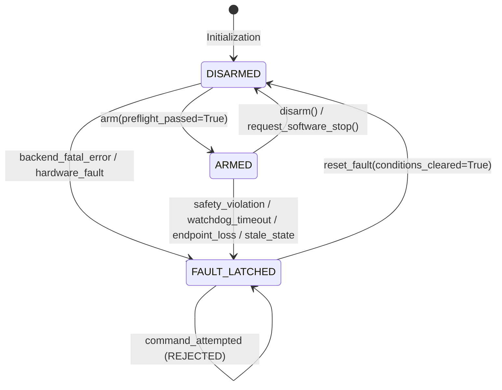

# VisionRobotTwin Phase B3 Design Specification: Hardware-Readiness Safety, Fault & Command-Authorization Layer

**Document ID:** `SPEC-2026-09-16-V1.3-PHASE-B3-COMMAND-SAFETY`  
**Status:** Approved Design Specification  
**Target Milestone:** VisionRobotTwin v1.3.0 Phase B3  
**Target Environments:** Windows 11 (PyBullet simulation baseline), Ubuntu 22.04 LTS (ROS2 Humble simulation)  
**Parent Phase:** Phase B2 (ROS2 Simulation Command Transport)  
**Subsequent Phase:** Phase B4 (Controlled Physical Backend Integration)  

---

## 1. Executive Summary & Objective

Phase B3 establishes an **independent defensive software safety, fault latching, preflight verification, and command authorization layer** (`GuardedRobotBackend` and `CommandSafetySupervisor`) interposed between high-level robot controllers (`GenericRobotController`, `MotionManager`, `ResolvedRateController`) and command-capable execution backends (`ROS2SimulationBackend`, `PyBulletRobotBackend`, `MockRobotBackend`).

### CRITICAL SAFETY & TERMINOLOGY MANDATES:
1. **NON-SAFETY-RATED APPLICATION-LEVEL SOFTWARE PROTECTION:**  
   Phase B3 provides application-level defensive software interlocks, preflight checks, command envelope enforcement, and software watchdogs. It is **NOT** a certified safety system, SIL-rated safety PLC, hardware emergency stop (E-stop), Safe Torque Off (STO), or protective stop.
2. **ZERO PHYSICAL HARDWARE COMMANDING:**  
   Phase B3 does **NOT** implement physical robot drivers, connect to real robot IPs, enable motor power, release mechanical brakes, or transmit physical commands.
3. **POLICY VS ENDPOINT PROOF:**  
   Software configuration flags (`environment="simulation"`) and ROS topic readiness heuristics cannot cryptographically prove that an endpoint is not routed to physical hardware. Hardware identity validation belongs exclusively to Phase B4.
4. **FAIL-CLOSED DUAL AUTHORIZATION:**  
   B3 introduces an independent guard state (`DISARMED` -> `ARMED`) that operates *on top of* B2's `enable_simulation_commands()`. Both authorization gates must be satisfied independently before motion commands are dispatched.
5. **FAIL-CLOSED DEFENSIVE REJECTION (NO SILENT CLAMPING):**  
   `GenericRobotController` performs nominal trajectory rate limiting and velocity clamping. When an unsafe setpoint (exceeding joint limits, exceeding velocity envelope, or containing an excessive step jump) reaches `GuardedRobotBackend`, the guard **REJECTS** the command with a fault rather than silently modifying or clamping it.

---

## 2. Command Architecture Comparison & Selected Strategy

We evaluated three placement paradigms for the safety supervision layer:

| Paradigm | Architecture | Advantages | Disadvantages | Decision |
|---|---|---|---|---|
| **Approach A: Controller Internal State** | Safety logic embedded directly inside `GenericRobotController` | Direct access to internal controller math | Mixes control mathematics with transport safety policy; complicates standalone unit testing; bypasses non-controller command sources | **REJECTED** |
| **Approach B: Guarded Backend Decorator** | `GuardedRobotBackend` wraps any `RobotBackend` implementing standard interface | Clear separation of concerns; defense-in-depth below controller; identical wrapping for Mock, PyBullet, ROS2 Simulation, and future B4 Physical backends | Slight object wrapping indirection | **SELECTED (RECOMMENDED)** |
| **Approach C: Top-Level Supervisor** | Supervisor placed above `MotionManager` | High-level task coordination | Direct velocity streaming from `ResolvedRateController` or external scripts bypasses the guard | **REJECTED** |

### Selected Architecture (Approach B):
```
+-------------------------------------------------------------+
|   Motion Planning & Velocity Control Layer                 |
|   (MotionManager / TrajectoryExecutor / ResolvedRate)       |
+-------------------------------------------------------------+
                              |
                              v
+-------------------------------------------------------------+
|   GenericRobotController                                    |
|   - Nominal joint rate limiting & velocity clamping         |
|   - Forward Kinematics & Cartesian error tracking           |
+-------------------------------------------------------------+
                              |
                              v
+=============================================================+
|   GuardedRobotBackend (RobotBackend Decorator)              |
|   - Independent Preflight Verification & Health Checking   |
|   - Software Safety Envelope (Limits, Velocity, Step Jump)  |
|   - Fail-Closed Arming State Machine (DISARMED / ARMED)     |
|   - Monotonic Command Watchdog with Injectable Clock        |
|   - Non-auto-clearing Fault Latch & Reset Policy            |
|   - Bounded Command Audit Logging & Monotonic Sequencing    |
|   - Software Stop Orchestration                             |
+=============================================================+
                              |
                              v
+-------------------------------------------------------------+
|   Underlying RobotBackend                                   |
|   - ROS2SimulationBackend (Phase B2)                        |
|   - PyBulletRobotBackend / MockRobotBackend (Phase A1)      |
|   - [Future Phase B4: PhysicalRobotBackend]                 |
+-------------------------------------------------------------+
```

---

## 3. Safety State Machine & Transitions

The safety layer is governed by a compact, non-auto-clearing state machine:



### Guard States:
1. `SafetyGuardState.DISARMED` (Initial default state):
   - Commands are disabled.
   - Ordinary position and velocity commands are rejected with `BackendCommandDisabledError`.
   - Watchdog is inactive.
2. `SafetyGuardState.ARMED`:
   - Commands authorized following successful preflight verification.
   - Watchdog becomes active upon dispatch of the first valid motion command.
3. `SafetyGuardState.FAULT_LATCHED`:
   - Latched upon detection of any critical safety violation, watchdog timeout, unexpected endpoint loss, or telemetry failure during active commanding.
   - All motion commands are rejected with `CommandSafetyViolationError` or `CommandWatchdogTimeoutError`.
   - **Crucial Rule:** Faults **NEVER** auto-clear. `reset_fault()` transitions strictly to `DISARMED`, requiring explicit re-arming.

---

## 4. Software Command Safety Envelope & Verification

`GuardedRobotBackend` validates every motion command against the static kinematic limits declared in `ResolvedRobotModel`:

1. **Finite Value & DoF Integrity:**
   - Command vector length must match `len(resolved_model.arm_joints)`.
   - Every value must be finite (`math.isfinite(val) == True`).
2. **Static Joint Limits & Margins:**
   - Position setpoint $q_i$ must satisfy:
     $$\text{lower\_limit}_i + \delta \le q_i \le \text{upper\_limit}_i - \delta$$
     where $\delta \ge 0$ is a configurable margin (`position_limit_margin_rad`).
3. **Maximum Position Step Guard:**
   - For position mode, the jump between target $q_i$ and current measured $q_{measured, i}$ must not exceed:
     $$|q_i - q_{measured, i}| \le \Delta q_{max}$$
     Preventing accidental coordinate unit errors, frame mismatches, or solver jump anomalies.
4. **Velocity Safety Envelope:**
   - For velocity mode, target $\dot{q}_i$ must satisfy:
     $$|\dot{q}_i| \le \alpha \cdot \dot{q}_{max, i}$$
     where $\alpha \in (0, 1.0]$ is `velocity_limit_scale`.
5. **Defensive Rejection:**
   - Any envelope violation immediately rejects the command, logs an audit record, and transitions the guard to `FAULT_LATCHED` with the corresponding `CommandSafetyFault` code.

---

## 5. Telemetry Freshness & Preflight Health Verification

Before transition to `ARMED` (and before every active position or ordinary velocity command):

1. **Telemetry Freshness:**
   - Telemetry must be successfully retrieved from `underlying_backend.get_joint_state()`.
   - Age of receive timestamp $t_{now} - t_{receive} \le \text{state\_timeout\_s}$.
2. **Canonical Mapping & Content Integrity:**
   - Telemetry `joint_names` must match `resolved_model.arm_joint_names` in exact canonical sequence.
   - Positions must be finite and DoF-consistent.
3. **Transport Capability & Health Preflight:**
   - Underlying backend must be connected (`is_connected() == True`) and healthy (`health_status() == HEALTHY`).
   - Declared `transport_capabilities` must support the requested mode (`position_commands` or `velocity_commands`) and `halt_motion`.

---

## 6. Monotonic Command Watchdog Architecture

To protect against application deadlocks, planner freezes, or network stalls during active motion control:

1. **Deterministic Start Condition:**
   - The watchdog countdown begins **only upon the first successful motion command** after arming (preventing spurious timeouts while armed and waiting).
2. **Injectable Clock Interface:**
   - Monotonic time is evaluated via an injectable callable `clock: Callable[[], float] = time.monotonic`, allowing millisecond-exact deterministic unit testing without real-time sleeps.
3. **Watchdog Monitor Execution:**
   - A dedicated lightweight monitor thread checks elapsed duration since last accepted command against `command_watchdog_timeout_s`.
4. **Timeout Action:**
   - When elapsed time $> \text{command\_watchdog\_timeout\_s}$:
     1. Dispatches `underlying_backend.halt_motion()`.
     2. If halt succeeds: latches `CommandSafetyFault.COMMAND_WATCHDOG_TIMEOUT`.
     3. If halt fails/raises: latches `CommandSafetyFault.COMMAND_WATCHDOG_HALT_FAILED`.
5. **No Keepalive Command Generation:**
   - The watchdog monitor thread **NEVER** republishes commands or injects motion. Its sole command-generating capability is best-effort halt dispatch.

---

## 7. Software Stop & Disarm Semantics

1. **`request_software_stop()`:**
   - Bypasses ordinary command envelope checks and can be invoked even when `FAULT_LATCHED`.
   - Invokes `underlying_backend.halt_motion()`.
   - Transitions state to `DISARMED` (or retains `FAULT_LATCHED` if stopping from a faulted state).
2. **`disarm()`:**
   - Immediately revokes command authorization.
   - If active motion was in progress, attempts `request_software_stop()` prior to disarming.
   - Documentation explicitly notes that software disarm does not guarantee physical deceleration if remote controller communication is broken.

---

## 8. Read-Only ROS2 Control Readiness Introspection

Phase B3 defines an optional, read-only diagnostic probe (`ROS2ControlReadinessProbe`) for introspecting `ros2_control` nodes on ROS2 Humble:

- **Read-Only Services Used:**
  - `controller_manager/srv/ListControllers` (Inspect active controllers, types, and claimed interfaces)
  - `controller_manager/srv/ListHardwareComponents` (Inspect active hardware plugins and lifecycle state)
  - `controller_manager/srv/ListHardwareInterfaces` (Inspect available command and state interfaces)
- **STRICT PROHIBITION ON MUTATING SERVICES:**
  - Zero calls to `SwitchController`, `LoadController`, `UnloadController`, `ConfigureController`, or `SetHardwareComponentState`.
  - VisionRobotTwin does not switch controllers or activate hardware.
- **`SoftwareCommandReadinessReport`:**
  - Data structure aggregating backend connection, telemetry freshness, model alignment, watchdog readiness, and (optionally) ROS controller readiness.

---

## 9. Phase B2 Validation Debt Note

During the Phase B2 pre-flight review, it was verified that Phase B2 established robust real ROS2 middleware integration tests (`Float64MultiArray` publisher/subscriber communication, freshness, halt, and lifecycle in `tests/ros2/test_ros2_simulation_backend.py`). Controller-level validation directly against `ros2_control_demo_example_3` was recorded as **B2 validation debt** to be closed during full simulation harness execution before physical Phase B4 commissioning.
