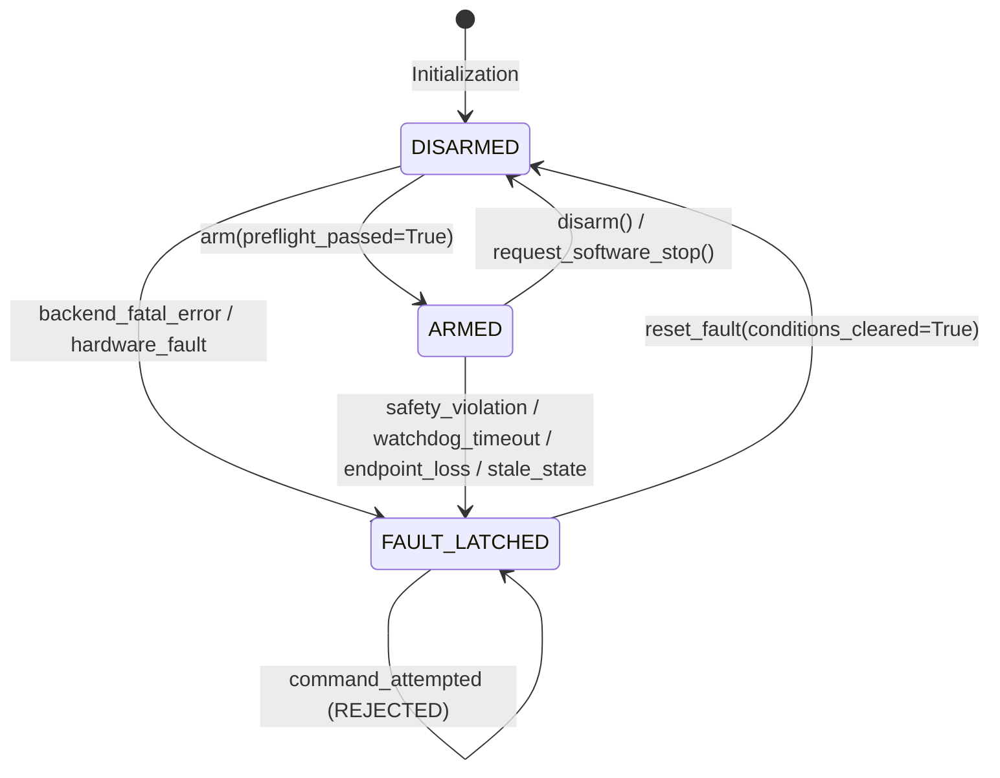

# VisionRobotTwin Phase B3 Design Specification: Hardware-Readiness Safety, Fault & Command-Authorization Layer

**Document ID:** `SPEC-2026-09-16-V1.3-PHASE-B3-COMMAND-SAFETY`  
**Status:** Approved Design Specification  
**Target Milestone:** VisionRobotTwin v1.3.0 Phase B3  
**Target Environments:** Windows 11 (PyBullet simulation baseline), Ubuntu 22.04 LTS (ROS2 Humble simulation)  
**Parent Phase:** Phase B2 (ROS2 Simulation Command Transport)  
**Subsequent Phase:** Phase B4 (Controlled Physical Backend Integration)  

---

## 1. Executive Summary & Objective

Phase B3 establishes an **independent defensive software safety, fault latching, preflight verification, and command authorization layer** (`GuardedRobotBackend` and `CommandSafetySupervisor`) interposed between high-level robot controllers (`GenericRobotController`, `MotionManager`, `ResolvedRateController`) and command-capable execution backends (`ROS2SimulationBackend`, `PyBulletRobotBackend`, `MockRobotBackend`).

### CRITICAL SAFETY & TERMINOLOGY MANDATES:
1. **NON-SAFETY-RATED APPLICATION-LEVEL SOFTWARE PROTECTION:**  
   Phase B3 provides application-level defensive software interlocks, preflight checks, command envelope enforcement, and software watchdogs. It is **NOT** a certified safety system, SIL-rated safety PLC, hardware emergency stop (E-stop), Safe Torque Off (STO), or protective stop.
2. **ZERO PHYSICAL HARDWARE COMMANDING:**  
   Phase B3 does **NOT** implement physical robot drivers, connect to real robot IPs, enable motor power, release mechanical brakes, or transmit physical commands.
3. **POLICY VS ENDPOINT PROOF:**  
   Software configuration flags (`environment="simulation"`) and ROS topic readiness heuristics cannot cryptographically prove that an endpoint is not routed to physical hardware. Hardware identity validation belongs exclusively to Phase B4.
4. **FAIL-CLOSED DUAL AUTHORIZATION:**  
   B3 introduces an independent guard state (`DISARMED` -> `ARMED`) that operates *on top of* B2's `enable_simulation_commands()`. Both authorization gates must be satisfied independently before motion commands are dispatched.
5. **FAIL-CLOSED DEFENSIVE REJECTION (NO SILENT CLAMPING):**  
   `GenericRobotController` performs nominal trajectory rate limiting and velocity clamping. When an unsafe setpoint (exceeding joint limits, exceeding velocity envelope, or containing an excessive step jump) reaches `GuardedRobotBackend`, the guard **REJECTS** the command with a fault rather than silently modifying or clamping it.

---

## 2. Command Architecture Comparison & Selected Strategy

We evaluated three placement paradigms for the safety supervision layer:

| Paradigm | Architecture | Advantages | Disadvantages | Decision |
|---|---|---|---|---|
| **Approach A: Controller Internal State** | Safety logic embedded directly inside `GenericRobotController` | Direct access to internal controller math | Mixes control mathematics with transport safety policy; complicates standalone unit testing; bypasses non-controller command sources | **REJECTED** |
| **Approach B: Guarded Backend Decorator** | `GuardedRobotBackend` wraps any `RobotBackend` implementing standard interface | Clear separation of concerns; defense-in-depth below controller; identical wrapping for Mock, PyBullet, ROS2 Simulation, and future B4 Physical backends | Slight object wrapping indirection | **SELECTED (RECOMMENDED)** |
| **Approach C: Top-Level Supervisor** | Supervisor placed above `MotionManager` | High-level task coordination | Direct velocity streaming from `ResolvedRateController` or external scripts bypasses the guard | **REJECTED** |

### Selected Architecture (Approach B):
```
+-------------------------------------------------------------+
|   Motion Planning & Velocity Control Layer                 |
|   (MotionManager / TrajectoryExecutor / ResolvedRate)       |
+-------------------------------------------------------------+
                              |
                              v
+-------------------------------------------------------------+
|   GenericRobotController                                    |
|   - Nominal joint rate limiting & velocity clamping         |
|   - Forward Kinematics & Cartesian error tracking           |
+-------------------------------------------------------------+
                              |
                              v
+=============================================================+
|   GuardedRobotBackend (RobotBackend Decorator)              |
|   - Independent Preflight Verification & Health Checking   |
|   - Software Safety Envelope (Limits, Velocity, Step Jump)  |
|   - Fail-Closed Arming State Machine (DISARMED / ARMED)     |
|   - Monotonic Command Watchdog with Injectable Clock        |
|   - Non-auto-clearing Fault Latch & Reset Policy            |
|   - Bounded Command Audit Logging & Monotonic Sequencing    |
|   - Software Stop Orchestration                             |
+=============================================================+
                              |
                              v
+-------------------------------------------------------------+
|   Underlying RobotBackend                                   |
|   - ROS2SimulationBackend (Phase B2)                        |
|   - PyBulletRobotBackend / MockRobotBackend (Phase A1)      |
|   - [Future Phase B4: PhysicalRobotBackend]                 |
+-------------------------------------------------------------+
```

---

## 3. Safety State Machine & Transitions

The safety layer is governed by a compact, non-auto-clearing state machine:



### Guard States:
1. `SafetyGuardState.DISARMED` (Initial default state):
   - Commands are disabled.
   - Ordinary position and velocity commands are rejected with `BackendCommandDisabledError`.
   - Watchdog is inactive.
2. `SafetyGuardState.ARMED`:
   - Commands authorized following successful preflight verification.
   - Watchdog becomes active upon dispatch of the first valid motion command.
3. `SafetyGuardState.FAULT_LATCHED`:
   - Latched upon detection of any critical safety violation, watchdog timeout, unexpected endpoint loss, or telemetry failure during active commanding.
   - All motion commands are rejected with `CommandSafetyViolationError` or `CommandWatchdogTimeoutError`.
   - **Crucial Rule:** Faults **NEVER** auto-clear. `reset_fault()` transitions strictly to `DISARMED`, requiring explicit re-arming.

---

## 4. Software Command Safety Envelope & Verification

`GuardedRobotBackend` validates every motion command against the static kinematic limits declared in `ResolvedRobotModel`:

1. **Command Serialization Lock:**
   - `GuardedRobotBackend` owns a dedicated `threading.RLock` (`_command_lock`) that strictly serializes all command dispatches, manual software stops, disarm-triggered stops, and watchdog-triggered stops. Normal command dispatches and watchdog halts can never execute concurrently.
   - When acquiring the lock for a watchdog halt, the monitor re-evaluates `guard_state`, `motion_session_active`, and last accepted command timestamp to prevent race conditions.
2. **Finite Value & DoF Integrity:**
   - Command vector length must match `len(resolved_model.arm_joints)`.
   - Every value must be finite (`math.isfinite(val) == True`).
3. **Static Joint Limits:**
   - Position setpoint $q_i$ must satisfy:
     $$\text{lower\_limit}_i - \epsilon \le q_i \le \text{upper\_limit}_i + \epsilon$$
     using numerical tolerance $\epsilon = 10^{-9}$. Per-joint limits follow the native coordinate system (radians for revolute, meters for prismatic).
4. **Maximum Position Step Guard:**
   - Configured via `max_position_step_by_joint: Optional[Tuple[float, ...]]` in native coordinate units (radians/meters).
   - For position mode, the jump between target $q_i$ and current measured $q_{measured, i}$ must not exceed:
     $$|q_i - q_{measured, i}| \le \Delta q_{max, i}$$
     Preventing accidental coordinate unit errors, frame mismatches, or solver jump anomalies.
5. **Velocity Safety Envelope:**
   - For velocity mode, target $\dot{q}_i$ must satisfy:
     $$|\dot{q}_i| \le \alpha \cdot \dot{q}_{max, i}$$
     where $\alpha \in (0, 1.0]$ is `velocity_limit_scale`.
6. **Optional Velocity Feedback:**
   - `require_velocity_feedback_for_velocity_commands: bool = False` (default). When False, velocity commands validate against commanded envelope and fresh position state (supporting position-only JointState telemetry). When True, `state.velocities` is additionally required.
7. **Defensive Rejection:**
   - Any envelope violation immediately rejects the command, logs an audit record, attempts a software stop if motion was active, and transitions the guard to `FAULT_LATCHED` with the corresponding `CommandSafetyFaultCode`.

---

## 5. Telemetry Freshness & Preflight Health Verification

Before transition to `ARMED` (and before every active position or ordinary velocity command):

1. **Telemetry Freshness:**
   - Telemetry must be successfully retrieved from `underlying_backend.get_joint_state()`.
   - Evaluated against local monotonic clock: $t_{monotonic, now} - t_{receive} \le \text{state\_timeout\_s}$.
2. **Canonical Mapping & Content Integrity:**
   - Telemetry `joint_names` must match `resolved_model.arm_joint_names` in exact canonical sequence.
   - Positions must be finite and DoF-consistent.
3. **Transport Capability & Health Preflight:**
   - Underlying backend must be connected (`is_connected() == True`) and healthy (`health_status() == HEALTHY`).
   - Declared `transport_capabilities` must support the requested mode (`position_commands` or `velocity_commands`) and `halt_motion`.
   - Pre-arm check failures while `DISARMED` do **not** latch `FAULT_LATCHED`; `arm()` simply fails and remains `DISARMED`.

---

## 6. Monotonic Command Watchdog Architecture

To protect against application deadlocks, planner freezes, or network stalls during active motion control:

1. **Pure Decision Evaluator & Decoupled Monitor:**
   - Pure evaluator logic (`CommandWatchdog.evaluate(now_s, armed, motion_active, last_cmd_s, timeout_s) -> bool`) operates independently of threading, enabling deterministic zero-sleep unit testing with fake monotonic clocks.
2. **Deterministic Start Condition:**
   - The watchdog countdown begins **only upon the first successful motion command** after arming (preventing spurious timeouts while armed and idle).
3. **Injectable Clock Interface:**
   - Monotonic time is evaluated via an injectable callable `clock: Callable[[], float] = time.monotonic`.
4. **Watchdog Monitor Execution & Race Prevention:**
   - A dedicated lightweight monitor thread checks elapsed duration since last accepted command against `command_watchdog_timeout_s`.
   - Upon timeout detection, the monitor thread acquires `_command_lock`, re-evaluates all state conditions, and if timeout is confirmed:
     1. Dispatches `underlying_backend.halt_motion()`.
     2. If halt succeeds: latches `CommandSafetyFaultCode.COMMAND_WATCHDOG_TIMEOUT`.
     3. If halt fails/raises: latches `CommandSafetyFaultCode.COMMAND_WATCHDOG_HALT_FAILED`.
5. **No Keepalive Command Generation:**
   - The watchdog monitor thread **NEVER** republishes commands or injects motion. Its sole command-generating capability is best-effort halt dispatch.

---

## 7. Software Stop, Disarm & Disconnect Semantics

1. **`request_software_stop()`:**
   - Privileged stop path: bypasses `ARMED` requirement, position/velocity envelopes, and existing `FAULT_LATCHED` state.
   - Acquires `_command_lock` and invokes `underlying_backend.halt_motion()`.
   - On success: sets `motion_session_active = False`, stops watchdog, and transitions state to `DISARMED` (or remains `FAULT_LATCHED` if stopping from a faulted state).
   - On failure: latches `CommandSafetyFaultCode.SOFTWARE_STOP_FAILED`.
2. **`disarm()`:**
   - If guard is `ARMED` but no successful motion command has occurred since arming: transitions directly to `DISARMED`.
   - If active motion occurred (`motion_session_active == True`): attempts `request_software_stop()` under command serialization. If stop succeeds, transitions to `DISARMED`; if stop fails, transitions to `FAULT_LATCHED` and leaves underlying transport connected for recovery.
3. **`disconnect()`:**
   - If active motion occurred, attempts software stop first. If stop fails, latches fault and does **not** tear down underlying transport. If stop succeeds or no motion occurred, stops watchdog, ensures `DISARMED`, and delegates disconnect to underlying backend.
4. **`connect()`:**
   - Delegates connection to underlying backend; leaves guard in `DISARMED` state.

---

## 8. Read-Only ROS2 Control Readiness Introspection

Phase B3 defines an optional, read-only diagnostic probe (`ROS2ControlReadinessProbe`) for introspecting `ros2_control` nodes on ROS2 Humble:

- **Read-Only Services Used:**
  - `controller_manager/srv/ListControllers` (Inspect active controllers, types, and claimed interfaces)
  - `controller_manager/srv/ListHardwareComponents` (Inspect active hardware plugins and lifecycle state)
  - `controller_manager/srv/ListHardwareInterfaces` (Inspect available command and state interfaces)
- **STRICT PROHIBITION ON MUTATING SERVICES:**
  - Zero calls to `SwitchController`, `LoadController`, `UnloadController`, `ConfigureController`, `SetHardwareComponentState`, or `ReloadControllerLibraries`.
- **`SoftwareCommandReadinessReport`:**
  - Data structure aggregating backend connection, telemetry freshness, model alignment, watchdog readiness, and optional external readiness probe results.

---

## 9. Gate Status & B2 Validation Debt Resolution

- **Phase B3 Software Command Safety Status:** COMPLETE (Defensive guard decorator, authorization state machine, envelopes, watchdog, and read-only readiness probe implemented).
- **Phase B4 Readiness Gate Status:** **BLOCKED** pending Phase B3.5 real `ros2_control` controller-level validation.
- **Validation Debt Statement:** End-to-end closed-loop validation against real `ros2_control` controller plugins (`ForwardCommandController`, `JointStateBroadcaster`, `hardware_interface` plugins on official `ros2_control_demo_example_3`) must be demonstrated and verified on ROS2 Humble before the B4 physical hardware readiness gate can be satisfied.

